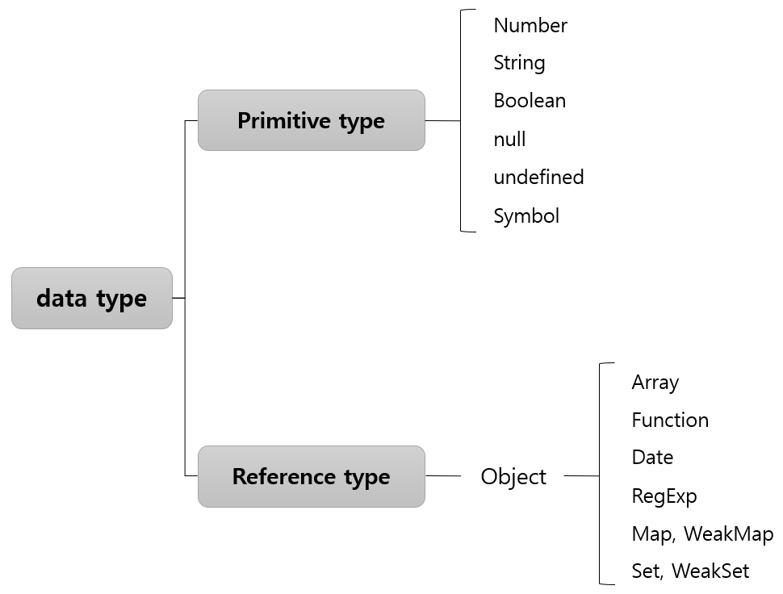

## 데이터 타입

{: width="180" height="100"} 

{: width="130" height="100"} 

### 기본형 데이터와 참조형 데이터

자바스크립트 데이터 타입에는 크게 기본형과 참조형이 있다. 
기본적으로 기본형은 불변값이고, 참조형은 가변값이다.  

- **기본형** 

  - Number, String, Boolean, null, undefined, Symbol은 모두 불변값이다. 
  - 한 번 만든 값은 다른 값으로 변경할 수 없으며, 변경은 새로 만드는 동작을 통해서만 이루어진다.  

- **참조형** 

  - Array, Function, Date, RegExp 등과 ES6에서 추가된 Map, WeakMap, Set, WeakSet 등이 Object의 하위 분류에 속한다. 
  - 참조형 데이터는 기본형 데이터와 달리, 프로퍼티 영역이 별도로 존재한다. 
  - 데이터 영역에 저장된 값은 모두 불변값이지만, 프로퍼티 영역에는 다른 값을 대입할 수 있기에 가변값이다. 
  - 참조형 데이터의 프로퍼티에 다시 참조형 데이터를 할당하는 경우를 일컬어 중첩 객체라고 한다. 
  - 참조 카운터가 0인 메모리 주소는 가비지 컬렉터의 수거 대상이 되며, 수거된 메모리는 다시 새로운 값을 할당할 수 있는 빈 공간이 된다.  
