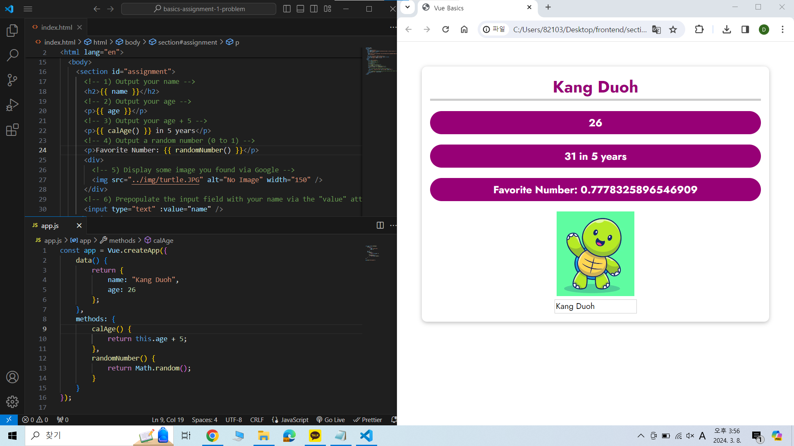
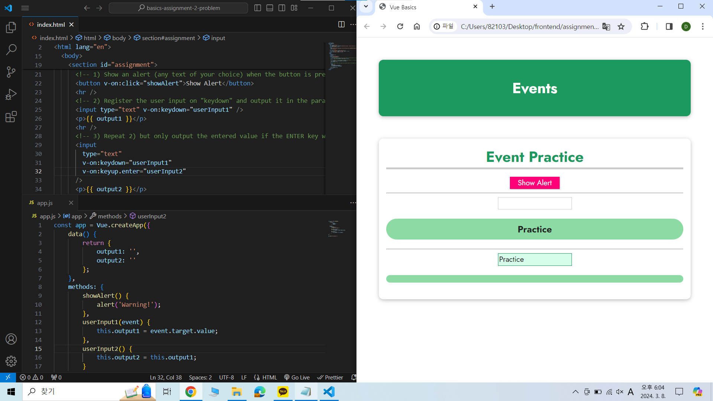

## 기초 및 핵심 개념 - Vue를 이용한 DOM 상호작용

[Vue - 완벽 가이드 (Router 및 Composition API 포함)](https://www.udemy.com/course/vue-router-composition-api/?couponCode=ST12MT030524)

 

### Vue 앱 연결 및 제어

- Vue 앱은 하나의 HTML 요소에만 연결할 수 있으며, 이를 위해 ID 선택자나 고유한 CSS 선택자를 사용한다. 
- Vue로 HTML 요소를 제어할 때, 해당 요소의 자식 요소도 제어할 수 있다.  

### 보간법

- '{{ }}'의 형태를 가지며, 콧수염 표현식이라고도 불린다. 
- 문자열을 템플릿에 덧붙여 동적으로 데이터를 표시하는 방식을 말한다.  

### v-bind 디렉티브

- 요소의 속성을 바인딩하기 위해 사용하며, 단방향으로만 데이터 바인딩을 수행한다.  

### 메서드

- Vue 인스턴스에서 사용할 메서드를 등록하는 옵션이다. 
- 등록된 메서드는 Vue 인스턴스를 이용해 직접 호출할 수 있으며, 디렉티브 표현식, 콧수염 표현식, 이벤트 핸들러로도 이용할 수 있다.  

### 실습: 데이터 바인딩

  

### 이벤트 처리

- Vue의 이벤트 처리는 HTML, 자바스크립트에서 사용하는 이벤트를 준용해서 사용하므로 HTML, 자바스크립트의 이벤트 처리 방법을 익혀두면 더욱 도움이 될 것이다. 
  [HTML](https://developer.mozilla.org/en-US/docs/Web/Events) 
  [자바스크립트](https://www.w3schools.com/tags/ref_eventattributes.asp) 
- 이벤트 처리는 'v-on' 디렉티브를 이용할 수 있으며, 'v-on:[이벤트명]' 혹은 '@이벤트명'으로 사용한다.  

### 실습: 이벤트 바인딩

  
