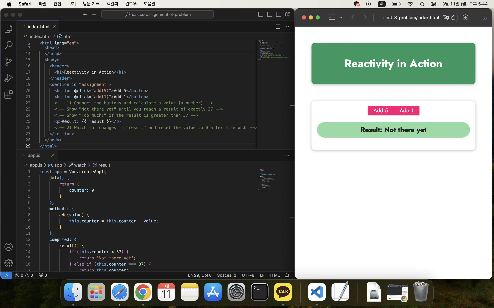
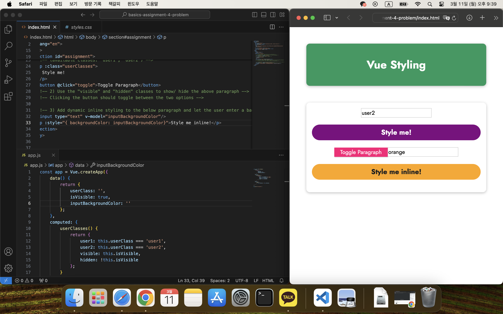

## 기초 및 핵심 개념 - Vue를 이용한 DOM 상호작용

[Vue - 완벽 가이드 (Router 및 Composition API 포함)](https://www.udemy.com/course/vue-router-composition-api/?couponCode=ST12MT030524)

<br/>

**Vue 앱 연결 및 제어**

- Vue 앱을 연결하고 제어하기 위해서는 Vue 인스턴스를 생성하고, HTML 요소에 마운트해야 한다.
- Vue로 HTML 요소를 제어할 때, 해당 요소의 자식 요소도 제어할 수 있다.
- 'Vue.createApp()' 메서드를 사용하여 Vue 앱을 생성하고, 생성된 앱 객체에 'mount()' 메서드를 사용하여 HTML 요소에 마운트한다.

  ```javascript
  const app = Vue.createApp({
    data() {
      return {
        ...
      };
    }
  });

  app.mount("#app");
  ```

<br/>

**보간법**

- Vue에서 데이터를 HTML에 삽입하기 위해 보간법을 사용한다. 이는 '{{ }}'의 형태를 가지며, 콧수염 표현식이라고도 한다.

<br/>

**v-bind 디렉티브**

- 요소의 속성을 동적으로 바인딩하기 위해 사용하며, 단방향 데이터 바인딩을 수행한다.
- 'v-bind:value'를 ':value'와 같이 축약하여 사용할 수 있다.

<br/>

**v-model 디렉티브**

- 사용자로부터 입력값을 받고 싶은 경우, 양방향 데이터 바인딩을 사용하면 편리하다.

<br/>

**계산된 속성**

- 다른 속성이나 데이터가 변경될 때 함수가 실행되어 값을 반환한다. 이는 의존하고 있는 속성 또는 데이터가 변경될 때만 다시 계산된다.
- 기존 데이터를 이용하여 읽기 전용의 값을 만들어내기 위해 사용된다.

<br/>

**메서드**

- Vue 인스턴스에서 사용할 메서드를 등록하는 옵션으로, 템플릿에서 호출할 수 있다.
- 계산식의 값을 화면에 출력하는 경우, 메서드보다 계산된 속성으로 구현하는 것이 바람직하다.

<br/>

**관찰 속성**

- 긴 시간을 요구하는 비동기 처리에 사용한다.<br/>
- 남용하게 되면, 코드의 실행 흐름 분석이 어려워지므로 주의해서 사용해야 한다.<br/>

<br/>

**이벤트 처리**

- Vue의 이벤트 처리는 HTML, 자바스크립트에서 사용하는 이벤트를 준용해서 사용한다.
  - [HTML](https://developer.mozilla.org/en-US/docs/Web/Events)
  - [자바스크립트](https://www.w3schools.com/tags/ref_eventattributes.asp)
- 'v-on:[이벤트명]'을 '@이벤트명'과 같이 축약하여 사용할 수 있다.

<br/>

**인라인 스타일**

- 'v-bind:style'로 작성하며, 데이터 속성에 자바스크립트 객체로 작성한다.
- 데이터 속성을 작성할 때 스타일 속성은 카멜 표기법을 사용해야 하며, 각 속성은 콤마(,) 기호를 이용해 구분한다.

<br/>

**CSS 클래스 바인딩**

- CSS 클래스명 문자열을 바인딩하거나, true/false 값을 가진 객체를 바인딩할 수 있다.
  
<br/>

**동적 스타일 바인딩**

- 계산된 속성이나 메서드가 반환하는 값이 CSS 클래스명의 문자열이거나 { 클래스명: true/false } 형태의 객체라면 쉽게 CSS 클래스로 바인딩할 수 있다.

<br/>

### 실습: 데이터 바인딩


```html
<!DOCTYPE html>
<html lang="en">
  <head>
    <meta charset="UTF-8" />
    <meta name="viewport" content="width=device-width, initial-scale=1.0" />
    <title>Vue Basics</title>
    <link
      href="https://fonts.googleapis.com/css2?family=Jost:wght@400;700&display=swap"
      rel="stylesheet"
    />
    <link rel="stylesheet" href="styles.css" />
    <script src="https://unpkg.com/vue@3" defer></script>
    <script src="app.js" defer></script>
  </head>
  <body>
    <section id="assignment">
      <!-- 1) Output your name -->
      <h2>{{ name }}</h2>
      <!-- 2) Output your age -->
      <p>{{ age }}</p>
      <!-- 3) Output your age + 5 -->
      <p>{{ calAge() }} in 5 years</p>
      <!-- 4) Output a random number (0 to 1) -->
      <p>Favorite Number: {{ randomNumber() }}</p>
      <div>
        <!-- 5) Display some image you found via Google -->
        
      </div>
      <!-- 6) Prepopulate the input field with your name via the "value" attribute -->
      <input type="text" :value="name" />
    </section>
  </body>
</html>
```

<br />

```javascript
const app = Vue.createApp({
  data() {
    return { name: "Kang Duoh", age: 26 };
  },
  methods: {
    calAge() {
      return this.age + 5;
    },
    randomNumber() {
      return Math.random();
    },
  },
});
app.mount("#assignment");
```

<br />

```css
* {
  box-sizing: border-box;
}
html {
  font-family: "Jost", sans-serif;
}
body {
  margin: 0;
}
section {
  box-shadow: 0 2px 8px rgba(0, 0, 0, 0.26);
  margin: 3rem;
  border-radius: 10px;
  padding: 1rem;
  text-align: center;
}
h2 {
  font-size: 2rem;
  border-bottom: 4px solid #ccc;
  color: #970076;
  margin: 0 0 1rem 0;
}
p {
  font-size: 1.25rem;
  font-weight: bold;
  background-color: #970076;
  padding: 0.5rem;
  color: white;
  border-radius: 25px;
}
input {
  font: inherit;
  border: 1px solid #ccc;
}
input:focus {
  outline: none;
  border-color: #1b995e;
  background-color: #d7fdeb;
}
button {
  font: inherit;
  cursor: pointer;
  border: 1px solid #ff0077;
  background-color: #ff0077;
  color: white;
  padding: 0.05rem 1rem;
  box-shadow: 1px 1px 2px rgba(0, 0, 0, 0.26);
}
button:hover,
button:active {
  background-color: #ec3169;
  border-color: #ec3169;
  box-shadow: 1px 1px 4px rgba(0, 0, 0, 0.26);
}
```

<br /><br />

### 실습: 이벤트 바인딩

<br />

```html
<!DOCTYPE html>
<html lang="en">
  <head>
    <meta charset="UTF-8" />
    <meta name="viewport" content="width=device-width, initial-scale=1.0" />
    <title>Vue Basics</title>
    <link
      href="https://fonts.googleapis.com/css2?family=Jost:wght@400;700&display=swap"
      rel="stylesheet"
    />
    <link rel="stylesheet" href="styles.css" />
    <script src="https://unpkg.com/vue@3" defer></script>
    <script src="app.js" defer></script>
  </head>
  <body>
    <header>
      <h1>Events</h1>
    </header>
    <section id="assignment">
      <h2>Event Practice</h2>
      <!-- 1) Show an alert (any text of your choice) when the button is pressed -->
      <button v-on:click="showAlert">Show Alert</button>
      <hr />
      <!-- 2) Register the user input on "keydown" and output it in the paragraph (hint: event.target.value helps) -->
      <input type="text" v-on:keydown="userInput1" />
      <p>{{ output1 }}</p>
      <hr />
      <!-- 3) Repeat 2) but only output the entered value if the ENTER key was pressed -->
      <input
        type="text"
        v-on:keydown="userInput1"
        v-on:keyup.enter="userInput2"
      />
      <p>{{ output2 }}</p>
    </section>
  </body>
</html>
```

<br />

```javascript
const app = Vue.createApp({
  data() {
    return { output1: "", output2: "" };
  },
  methods: {
    showAlert() {
      alert("Warning!");
    },
    userInput1(event) {
      this.output1 = event.target.value;
    },
    userInput2() {
      this.output2 = this.output1;
    },
  },
});
app.mount("#assignment");
```

<br />

```css
* {
  box-sizing: border-box;
}
html {
  font-family: "Jost", sans-serif;
}
body {
  margin: 0;
}
header {
  box-shadow: 0 2px 8px rgba(0, 0, 0, 0.26);
  margin: 3rem;
  border-radius: 10px;
  padding: 1rem;
  background-color: #1b995e;
  color: white;
  text-align: center;
}
#assignment {
  box-shadow: 0 2px 8px rgba(0, 0, 0, 0.26);
  margin: 3rem;
  border-radius: 10px;
  padding: 1rem;
  text-align: center;
}
#assignment h2 {
  font-size: 2rem;
  border-bottom: 4px solid #ccc;
  color: #1b995e;
  margin: 0 0 1rem 0;
}
#assignment p {
  font-size: 1.25rem;
  font-weight: bold;
  background-color: #8ddba4;
  padding: 0.5rem;
  color: #1f1f1f;
  border-radius: 25px;
}
#assignment input {
  font: inherit;
  border: 1px solid #ccc;
}
#assignment input:focus {
  outline: none;
  border-color: #1b995e;
  background-color: #d7fdeb;
}
#assignment button {
  font: inherit;
  cursor: pointer;
  border: 1px solid #ff0077;
  background-color: #ff0077;
  color: white;
  padding: 0.05rem 1rem;
  box-shadow: 1px 1px 2px rgba(0, 0, 0, 0.26);
}
#assignment button:hover,
#assignment button:active {
  background-color: #ec3169;
  border-color: #ec3169;
  box-shadow: 1px 1px 4px rgba(0, 0, 0, 0.26);
}
```

<br/><br/>

### 실습: 반응성

<br/>

```html
<!DOCTYPE html>
<html lang="en">
  <head>
    <meta charset="UTF-8" />
    <meta name="viewport" content="width=device-width, initial-scale=1.0" />
    <title>Vue Basics</title>
    <link
      href="https://fonts.googleapis.com/css2?family=Jost:wght@400;700&display=swap"
      rel="stylesheet"
    />
    <link rel="stylesheet" href="styles.css" />
    <script src="https://unpkg.com/vue@3" defer></script>
    <script src="app.js" defer></script>
  </head>
  <body>
    <header>
      <h1>Reactivity in Action</h1>
    </header>
    <section id="assignment">
      <button @click="add(5)">Add 5</button>
      <button @click="add(1)">Add 1</button>
      <!-- 1) Connect the buttons and calculate a value (a number) -->
      <!-- Show "Not there yet" until you reach a result of exactly 37 -->
      <!-- Show "Too much!" if the result is greater than 37 -->
      <p>Result: {{ result }}</p>
      <!-- 2) Watch for changes in "result" and reset the value to 0 after 5 seconds -->
    </section>
  </body>
</html>
```

<br/>

```javascript
const app = Vue.createApp({
    data() {
        return {
            counter: 0
        };
    },
    methods: {
        add(value) {
            this.counter = this.counter + value;
        }
    },
    computed: {
        result() {
            if (this.counter < 37) {
                return 'Not there yet';
            } else if (this.counter === 37) {
                return this.counter;
            } else {
                return 'Too much!';
            }
        }
    },
    watch: {
        result() {
            const that = this;
            setTimeout(function () {
                that.counter = 0;
            }, 5000);
        }
    }
});

app.mount("#assignment");
```

<br />

```css
* {
  box-sizing: border-box;
}

html {
  font-family: 'Jost', sans-serif;
}

body {
  margin: 0;
}

header {
  box-shadow: 0 2px 8px rgba(0, 0, 0, 0.26);
  margin: 3rem;
  border-radius: 10px;
  padding: 1rem;
  background-color: #1b995e;
  color: white;
  text-align: center;
}

#assignment {
  box-shadow: 0 2px 8px rgba(0, 0, 0, 0.26);
  margin: 3rem;
  border-radius: 10px;
  padding: 1rem;
  text-align: center;
}

#assignment h2 {
  font-size: 2rem;
  border-bottom: 4px solid #ccc;
  color: #1b995e;
  margin: 0 0 1rem 0;
}

#assignment p {
  font-size: 1.25rem;
  font-weight: bold;
  background-color: #8ddba4;
  padding: 0.5rem;
  color: #1f1f1f;
  border-radius: 25px;
}

#assignment input {
  font: inherit;
  border: 1px solid #ccc;
}

#assignment input:focus {
  outline: none;
  border-color: #1b995e;
  background-color: #d7fdeb;
}

#assignment button {
  font: inherit;
  cursor: pointer;
  border: 1px solid #ff0077;
  background-color: #ff0077;
  color: white;
  padding: 0.05rem 1rem;
  box-shadow: 1px 1px 2px rgba(0, 0, 0, 0.26);
}

#assignment button:hover,
#assignment button:active {
  background-color: #ec3169;
  border-color: #ec3169;
  box-shadow: 1px 1px 4px rgba(0, 0, 0, 0.26);
}
```

<br/><br/>

### 실습: 동적 스타일링

<br/>

```html
<!DOCTYPE html>
<html lang="en">
  <head>
    <meta charset="UTF-8" />
    <meta name="viewport" content="width=device-width, initial-scale=1.0" />
    <title>Vue Basics</title>
    <link
      href="https://fonts.googleapis.com/css2?family=Jost:wght@400;700&display=swap"
      rel="stylesheet"
    />
    <link rel="stylesheet" href="styles.css" />
    <script src="https://unpkg.com/vue@3" defer></script>
    <script src="app.js" defer></script>
  </head>
  <body>
    <header>
      <h1>Vue Styling</h1>
    </header>
    <section id="assignment">
      <!-- 1) Fetch the user input and use it as a CSS class -->
      <!-- The entered class should be added to the below paragraph -->
      <input type="text" v-model="userClass"/>
      <!-- (available classes: "user1", "user2") -->
      <p :class="userClasses">
        Style me!
      </p>
      <button @click="toggle">Toggle Paragraph</button>
      <!-- 2) Use the "visible" and "hidden" classes to show/ hide the above paragraph -->
      <!-- Clicking the button should toggle between the two options -->

      <!-- 3) Add dynamic inline styling to the below paragraph and let the user enter a background-color -->
      <input type="text" v-model="inputBackgroundColor"/>
      <p :style="{ backgroundColor: inputBackgroundColor}">Style me inline!</p>
    </section>
  </body>
</html>
```

<br/>

```javascript
const app = Vue.createApp({
    data() {
        return {
            userClass: '',
            isVisible: true,
            inputBackgroundColor: ''
        };
    },
    computed: {
        userClasses() {
            return {
                user1: this.userClass === 'user1',
                user2: this.userClass === 'user2',
                visible: this.isVisible,
                hidden: !this.isVisible
            };
        }
    },
    methods: {
        toggle() {
            this.isVisible = !this.isVisible;
        }
    }
});

app.mount('#assignment');
```

<br/>

```css
* {
  box-sizing: border-box;
}

html {
  font-family: 'Jost', sans-serif;
}

body {
  margin: 0;
}

header {
  box-shadow: 0 2px 8px rgba(0, 0, 0, 0.26);
  margin: 3rem;
  border-radius: 10px;
  padding: 1rem;
  background-color: #1b995e;
  color: white;
  text-align: center;
}

#assignment {
  box-shadow: 0 2px 8px rgba(0, 0, 0, 0.26);
  margin: 3rem;
  border-radius: 10px;
  padding: 1rem;
  text-align: center;
}

#assignment h2 {
  font-size: 2rem;
  border-bottom: 4px solid #ccc;
  color: #1b995e;
  margin: 0 0 1rem 0;
}

p {
  font-size: 1.25rem;
  font-weight: bold;
  background-color: #8ddba4;
  padding: 0.5rem;
  color: #1f1f1f;
  border-radius: 25px;
}

#assignment input {
  font: inherit;
  border: 1px solid #ccc;
}

#assignment input:focus {
  outline: none;
  border-color: #1b995e;
  background-color: #d7fdeb;
}

#assignment button {
  font: inherit;
  cursor: pointer;
  border: 1px solid #ff0077;
  background-color: #ff0077;
  color: white;
  padding: 0.05rem 1rem;
  box-shadow: 1px 1px 2px rgba(0, 0, 0, 0.26);
}

#assignment button:hover,
#assignment button:active {
  background-color: #ec3169;
  border-color: #ec3169;
  box-shadow: 1px 1px 4px rgba(0, 0, 0, 0.26);
}

.user1 {
  background-color: blue;
  color: white;
}

.user2 {
  background-color: purple;
  color: white;
}

.hidden {
  display: none;
}

.visible {
  display: block;
}
```