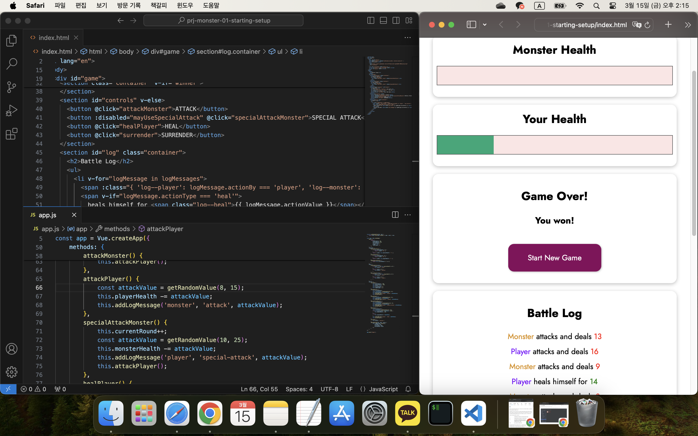

## 강의 프로젝트: 몬스터 슬레이어 게임(Monster Slayer)

[Vue - 완벽 가이드 (Router 및 Composition API 포함)](https://www.udemy.com/course/vue-router-composition-api/?couponCode=ST12MT030524)

<br/>

**앞서 배운 핵심 기능들을 프로젝트에 적용함으로써, Vue에 대한 이해를 높인다.**

<br/>



```html
<!DOCTYPE html>
<html lang="en">
  <head>
    <meta charset="UTF-8" />
    <meta name="viewport" content="width=device-width, initial-scale=1.0" />
    <title>Vue Basics</title>
    <link
      href="https://fonts.googleapis.com/css2?family=Jost:wght@400;700&display=swap"
      rel="stylesheet"
    />
    <link rel="stylesheet" href="styles.css" />
    <script src="https://unpkg.com/vue@3" defer></script>
    <script src="app.js" defer></script>
  </head>
  <body>
    <header>
      <h1>Monster Slayer</h1>
    </header>
    <div id="game">
      <section id="monster" class="container">
        <h2>Monster Health</h2>
        <div class="healthbar">
          <div class="healthbar__value" :style="monsterBarStyles"></div>
        </div>
      </section>
      <section id="player" class="container">
        <h2>Your Health</h2>
        <div class="healthbar">
          <div class="healthbar__value" :style="playerBarStyles"></div>
        </div>
      </section>
      <section class="container" v-if="winner">
        <h2>Game Over!</h2>
        <h3 v-if="winner === 'monster'"> You lost!</h3>
        <h3 v-else-if="winner === 'player'"> You won!</h3>
        <h3 v-else> It's a draw!</h3>
        <button @click="startGame">Start New Game</button>
      </section>
      <section id="controls" v-else>
        <button @click="attackMonster">ATTACK</button>
        <button :disabled="mayUseSpecialAttack" @click="specialAttackMonster">SPECIAL ATTACK</button>
        <button @click="healPlayer">HEAL</button>
        <button @click="surrender">SURRENDER</button>
      </section>
      <section id="log" class="container">
        <h2>Battle Log</h2>
        <ul>
          <li v-for="logMessage in logMessages">
            <span :class="{ 'log--player': logMessage.actionBy === 'player', 'log--monster': logMessage.actionBy === 'monster' }">{{ logMessage.actionBy === 'player' ? 'Player' : 'Monster' }}</span>
            <span v-if="logMessage.actionType === 'heal'">
              heals himself for <span class="log--heal">{{ logMessage.actionValue }}</span></span>
            <span v-else>
              attacks and deals <span class="log--damage">{{ logMessage.actionValue }}</span>
            </span>
          </li>
        </ul>
      </section>
    </div>
  </body>
</html>
```

<br/>

```javascript
function getRandomValue(min, max) {
    return Math.floor(Math.random() * (max - min)) + min;
}

const app = Vue.createApp({
    data() {
        return {
            playerHealth: 100,
            monsterHealth: 100,
            currentRound: 0,
            winner: null,
            logMessages: []
        };
    },
    computed: {
        monsterBarStyles() {
            if (this.monsterHealth < 0) {
                return { width: '0%' };
            }
            return { width: this.monsterHealth + '%' };
        },
        playerBarStyles() {
            if (this.playerHealth < 0) {
                return { width: '0%' };
            }
            return { width: this.playerHealth + '%' };
        },
        mayUseSpecialAttack() {
            return this.currentRound % 3 !== 0;
        }
    },
    watch: {
        playerHealth(value) {
            if (value <= 0 && this.monsterHealth <= 0) {
                this.winner = 'draw';
            }
            else if (value <= 0) {
                this.winner = 'monster'
            }
        },
        monsterHealth(value) {
            if (value <= 0 && this.playerHealth <= 0) {
                this.winner = 'draw';
            }
            else if (value <= 0) {
                this.winner = 'player';
            }
        }
    },
    methods: {
        startGame() {
            this.playerHealth = 100;
            this.monsterHealth = 100;
            this.winner = null;
            this.currentRound = 0;
            this.logMessages = [];
        },
        attackMonster() {
            this.currentRound++;
            const attackValue = getRandomValue(5, 12);
            this.monsterHealth -= attackValue;
            this.addLogMessage('player', 'attack', attackValue);
            this.attackPlayer();
        },
        attackPlayer() {
            const attackValue = getRandomValue(8, 15);
            this.playerHealth -= attackValue;
            this.addLogMessage('monster', 'attack', attackValue);
        },
        specialAttackMonster() {
            this.currentRound++;
            const attackValue = getRandomValue(10, 25);
            this.monsterHealth -= attackValue;
            this.addLogMessage('player', 'special-attack', attackValue);
            this.attackPlayer();
        },
        healPlayer() {
            this.currentRound++;
            const healValue = getRandomValue(8, 20);
            if (this.playerHealth + healValue > 100) {
                this.playerHealth = 100;
            }
            else {
                this.playerHealth += healValue;
            }
            this.addLogMessage('player', 'heal', healValue);
            this.attackPlayer();
        },
        surrender() {
            this.winner = 'monster';
        },
        addLogMessage(who, what, value) {
            this.logMessages.unshift({
                actionBy: who,
                actionType: what,
                actionValue: value
            });
        }
    }
});

app.mount('#game');
```
<br/>

```css
* {
  box-sizing: border-box;
}

html {
  font-family: 'Jost', sans-serif;
}

body {
  margin: 0;
}

header {
  box-shadow: 0 2px 8px rgba(0, 0, 0, 0.26);
  padding: 0.5rem;
  background-color: #880017;
  color: white;
  text-align: center;
  margin-bottom: 2rem;
}

section {
  width: 90%;
  max-width: 40rem;
  margin: auto;
}

.healthbar {
  width: 100%;
  height: 40px;
  border: 1px solid #575757;
  margin: 1rem 0;
  background: #fde5e5;
}

.healthbar__value {
  background-color: #00a876;
  width: 100%;
  height: 100%;
}

.container {
  text-align: center;
  padding: 0.5rem;
  margin: 1rem auto;
  box-shadow: 0 2px 8px rgba(0, 0, 0, 0.26);
  border-radius: 12px;
}

#monster h2,
#player h2 {
  margin: 0.25rem;
}

#controls {
  display: flex;
  flex-direction: row;
  flex-wrap: wrap;
  align-items: center;
  justify-content: center;
}

button {
  font: inherit;
  border: 1px solid #88005b;
  background-color: #88005b;
  color: white;
  padding: 1rem 2rem;
  border-radius: 12px;
  margin: 1rem;
  width: 12rem;
  cursor: pointer;
  box-shadow: 1px 1px 4px rgba(0, 0, 0, 0.26);
}

button:focus {
  outline: none;
}

button:hover,
button:active {
  background-color: #af0a78;
  border-color: #af0a78;
  box-shadow: 1px 1px 8px rgba(0, 0, 0, 0.26);
}

button:disabled {
  background-color: #ccc;
  border-color: #ccc;
  box-shadow: none;
  color: #3f3f3f;
  cursor: not-allowed;
}

#log ul {
  list-style: none;
  margin: 0;
  padding: 0;
}

#log li {
  margin: 0.5rem 0;
}

.log--player {
  color: #7700ff;
}

.log--monster {
  color: #da8d00;
}

.log--damage {
  color: red;
}

.log--heal {
  color: green;
}
```