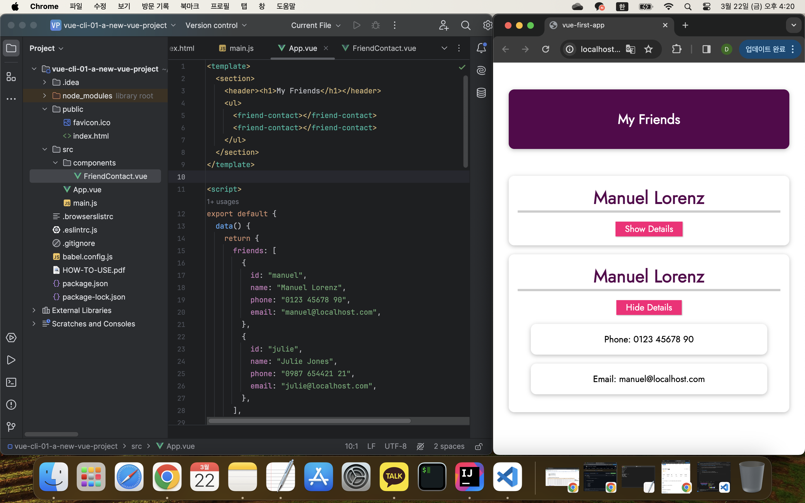

## Vue CLI를 사용하여 더 나은 개발 설정 및 워크플로우로 전환하기

[Vue - 완벽 가이드 (Router 및 Composition API 포함)](https://www.udemy.com/course/vue-router-composition-api/?couponCode=ST12MT030524)

 

**Vue CLI를 사용하면?**

- [Vue CLI 가이드](https://cli.vuejs.org/guide/)
- 프로젝트 개발 시 https:// 또는 http:// 프로토콜을 사용할 수 있다.
- 빌드 워크플로우를 통해 코드를 브라우저에서 실행 가능한 형태로 변환할 수 있다.

 

