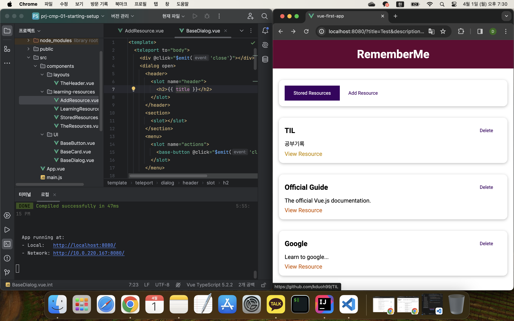

## 강의 프로젝트: 학습 리소스 앱

[Vue - 완벽 가이드 (Router 및 Composition API 포함)](https://www.udemy.com/course/vue-router-composition-api/?couponCode=ST12MT030524)

 

**앞서 배운 핵심 기능들을 프로젝트에 적용함으로써, 컴포넌트를 다루는 방식과 더 확장된 Vue 앱을 구축하는 방법, 그리고 여러 기능이 어떻게 함께 작동하는지에 대한 이해를 높인다.**

 

[학습 리소스 앱_ 소스코드](https://github.com/kduoh99/TIL/tree/main/Vue.js/PJ/prj-cmp-01-starting-setup/src)