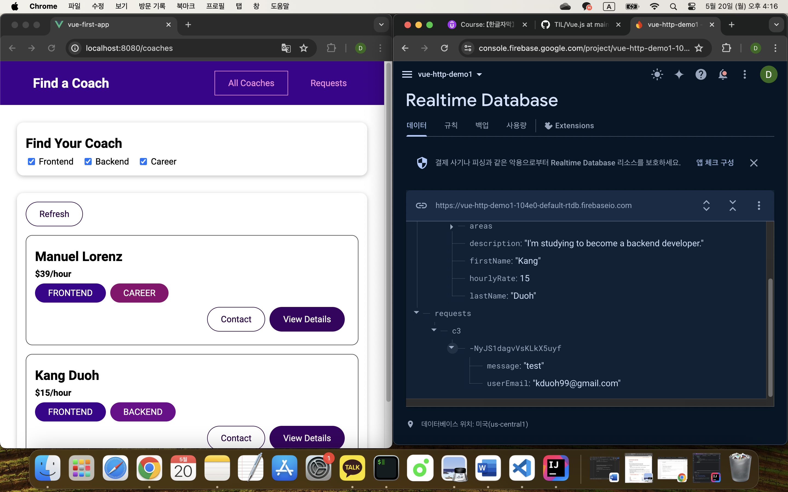

## 메인 프로젝트: "코치 찾기" 웹 앱

[Vue - 완벽 가이드 (Router 및 Composition API 포함)](https://www.udemy.com/course/vue-router-composition-api/?couponCode=ST12MT030524)

 

**많은 컴포넌트와 라우팅 그리고 애니메이션, Vuex를 사용하여 모든 상태와 데이터를 관리해본다.**

 

["코치 찾기" 웹 앱_ 소스코드](https://github.com/kduoh99/TIL/tree/main/Vue.js/PJ/main-prj-01-starting-setup/src)