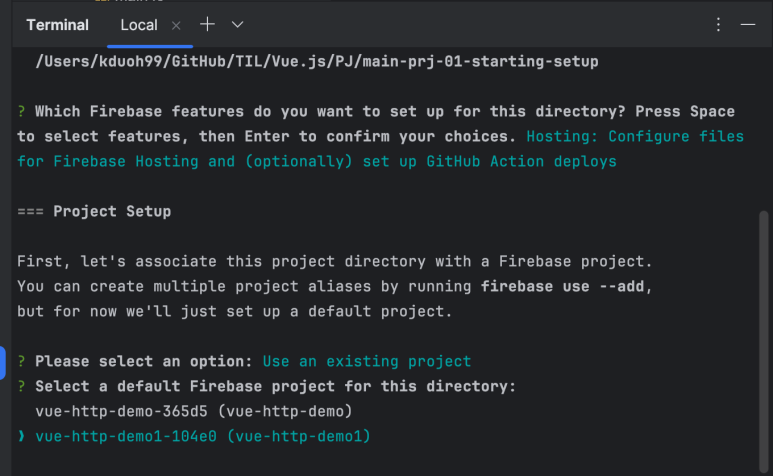
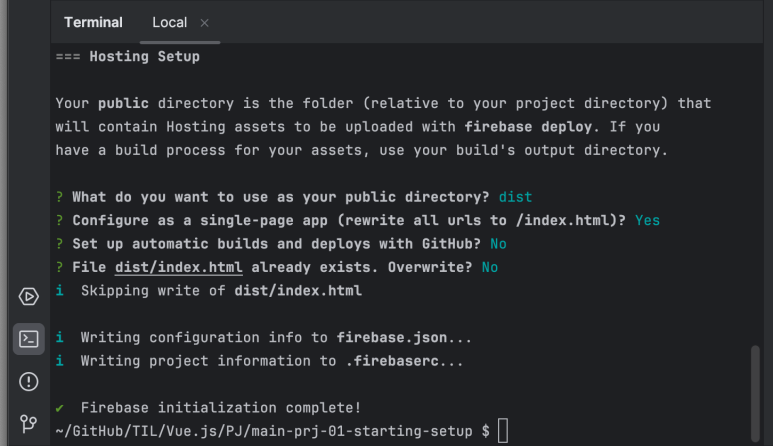
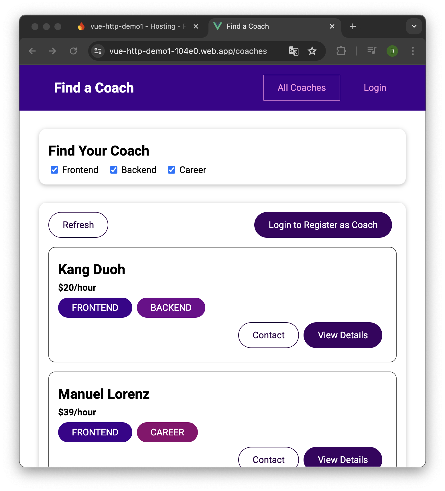

## Vue 앱 최적화 및 배포하기

[Vue - 완벽 가이드 (Router 및 Composition API 포함)](https://www.udemy.com/course/vue-router-composition-api/?couponCode=ST12MT030524)

<br/>

Vue 애플리케이션은 클라이언트 측에서 실행되는 JavaScript 애플리케이션이다.<br/>
프로젝트 설정에 따라 모든 코드는 브라우저가 이해할 수 있는 JavaScript 코드로 변환된다.

<br/>

**개발 서버와 실제 배포의 차이**

개발 중에는 `npm run serve` 명령어를 사용하여 로컬 서버에서 애플리케이션을 실행하고, Vue가 화면에 렌더링하는 내용을 브라우저에서 확인할 수 있다. 그러나 실제 배포는 로컬 서버가 아닌, 정적 웹 호스팅 서비스에 애플리케이션을 올려 사용자에게 제공하는 것이다.

<br/>

**배포 준비 과정**

- 코드 테스트와 리팩터링
  
  배포 전, 여러 시나리오를 테스트하여 코드에 존재할 수 있는 잠재적 오류를 찾아 수정해야 한다.<br/>
  또한, 코드 리팩터링을 통해 코드의 가독성과 유지보수성을 향상시켜야 한다.

- 비동기 컴포넌트 활용
  
  애플리케이션 성능을 최적화하기 위해 Vue에서 지원하는 비동기 컴포넌트를 활용할 수 있다.<br/>
  비동기 컴포넌트는 필요할 때만 로드되며, `defineAsyncComponent` 함수를 사용하여 정의할 수 있다.

<br/>

**정적 웹 호스팅 서비스**

Vue 애플리케이션은 정적 웹 애플리케이션으로, 서버에서 실행되는 백엔드 코드를 필요로 하지 않는다.<br/>
따라서 AWS S3, Firebase Hosting, Netlify 등의 정적 웹사이트 호스팅 서비스를 이용하여 배포할 수 있다.


<br/>

**싱글 페이지 애플리케이션(SPA) 라우팅 및 호스팅 시 주의사항**

싱글 페이지 애플리케이션을 호스팅할 때, 모든 URL 요청을 단일 `index.html` 파일로 리디렉션해야 한다. 이는 서버가 모든 경로를 무시하고 항상 `index.html`을 반환하도록 설정하는 것을 의미한다. 이로써 Vue 라우터가 클라이언트 사이드에서 라우팅을 처리할 수 있도록 한다.

*Firebase Hosting을 사용할 경우, 초기 설정에서 싱글 페이지 애플리케이션 옵션을 선택하면 자동으로 이 설정이 적용된다.*

<br/>

**배포 과정**

- 빌드(Build)
  
  작성한 코드를 브라우저가 이해할 수 있는 코드로 변환하고 최적화하기 위해 `npm run build` 명령어를 실행한다. 이 명령어는 모든 코드를 분석하여 필요한 파일들을 하나의 큰 앱 파일과 비동기 컴포넌트를 위한 작은 청크 파일로 묶어 준다.

  *`npm run build` 명령어 실행이 오류날 경우, Node 버전을 확인하고 알맞게 수정해야 된다.*

  *빌드가 완료되면 `dist` 폴더가 생성된다. 이 폴더에는 최적화된 `JavaScript`, `CSS` 파일과 함께 싱글 페이지 `index.html` 파일이 포함된다.*

- 호스팅
  
  `dist` 폴더의 내용을 정적 호스팅 서버에 업로드한다.

  - Firebase CLI 설치
  
    ```zsh
    npm install -g firebase-tools
    ```

    *Linux나 macOS는 명령어 앞에 `sudo`를 추가하여 설치해야 한다.*

    ```zsh
    sudo npm install -g firebase-tools
    ```

  - Firebase 로그인
  
    ```zsh
    firebase login
    ```

  - Firebase 초기화
  
    ```zsh
    firebase init
    ```

    *`Hosting` 옵션, 기존 Firebase 프로젝트를 선택한다.
    공개 디렉터리로 `dist` 폴더를 지정하고, 싱글 페이지 애플리케이션 설정에서 `y`를 선택한다.*

  

  

  - 배포
  
    ```zsh
    firebase deploy
    ```

    *배포 후 제공된 URL을 통해 실제 웹 서버에서 애플리케이션이 실행되는 것을 확인할 수 있다.*

  

  

<br/>

["코치 찾기" 웹 앱_ 소스코드](https://github.com/kduoh99/TIL/tree/main/Vue.js/PJ/main-prj-01-starting-setup/src)