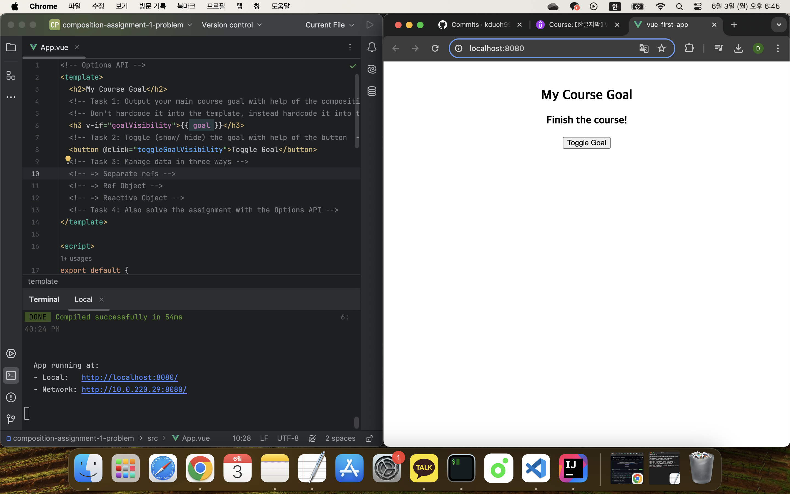

## 컴포지션 API - 옵션 API 대체하기

[Vue - 완벽 가이드 (Router 및 Composition API 포함)](https://www.udemy.com/course/vue-router-composition-api/?couponCode=ST12MT030524)

<br/>

### 실습: 데이터 및 함수



```vue
<!-- Composition API -->
<template>
  <h2>My Course Goal</h2>
  <h3 v-if="courseData.goalVisibility">{{ courseData.goal }}</h3>
  <button @click="toggleGoalVisibility">Toggle Goal</button>
</template>

<script>
import { reactive } from 'vue';

export default {
  setup() {
  // Reactive Object
    const courseData = reactive({
      goal: 'Finish the course!',
      goalVisibility: false
    });
  
    function toggleGoalVisibility() {
      courseData.goalVisibility = !courseData.goalVisibility;
    }
  
    return {
      courseData,
      toggleGoalVisibility
    };
  }
};
</script>

<style>
html {
  font-family: sans-serif;
}

body {
  margin: 3rem;
  text-align: center;
}
</style>
```

```vue
<!-- Options API -->
<template>
  <h2>My Course Goal</h2>
  <h3 v-if="goalVisibility">{{ goal }}</h3>
  <button @click="toggleGoalVisibility">Toggle Goal</button>
</template>

<script>
export default {
  data() {
    return {
      goal: 'Finish the course!',
      goalVisibility: false
    };
  },
  methods: {
    toggleGoalVisibility() {
      this.goalVisibility = !this.goalVisibility;
    }
  },
};
</script>

<style>
html {
  font-family: sans-serif;
}

body {
  margin: 3rem;
  text-align: center;
}
</style>
```