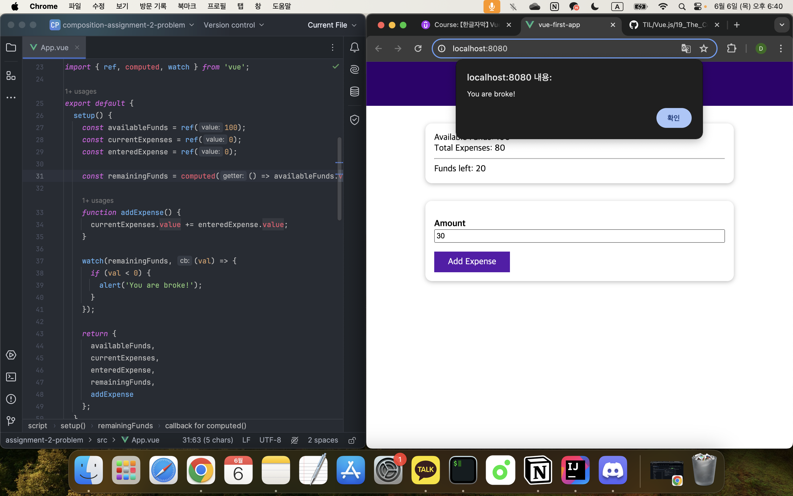

## 컴포지션 API - 옵션 API 대체하기

[Vue - 완벽 가이드 (Router 및 Composition API 포함)](https://www.udemy.com/course/vue-router-composition-api/?couponCode=ST12MT030524)

<br/>

### 실습: 데이터 및 함수


```vue
<!-- Composition API -->
<template>
  <h2>My Course Goal</h2>
  <h3 v-if="courseData.goalVisibility">{{ courseData.goal }}</h3>
  <button @click="toggleGoalVisibility">Toggle Goal</button>
</template>

<script>
import { reactive } from 'vue';

export default {
  setup() {
  // Reactive Object
    const courseData = reactive({
      goal: 'Finish the course!',
      goalVisibility: false
    });
  
    function toggleGoalVisibility() {
      courseData.goalVisibility = !courseData.goalVisibility;
    }
  
    return {
      courseData,
      toggleGoalVisibility
    };
  }
};
</script>

<style>
html {
  font-family: sans-serif;
}

body {
  margin: 3rem;
  text-align: center;
}
</style>
```

```vue
<!-- Options API -->
<template>
  <h2>My Course Goal</h2>
  <h3 v-if="goalVisibility">{{ goal }}</h3>
  <button @click="toggleGoalVisibility">Toggle Goal</button>
</template>

<script>
export default {
  data() {
    return {
      goal: 'Finish the course!',
      goalVisibility: false
    };
  },
  methods: {
    toggleGoalVisibility() {
      this.goalVisibility = !this.goalVisibility;
    }
  },
};
</script>

<style>
html {
  font-family: sans-serif;
}

body {
  margin: 3rem;
  text-align: center;
}
</style>
```

<br/>

### 실습: 컴포지션 API 핵심 구성



```
<template>
  <header>
    <h1>Expense Tracker</h1>
  </header>
  <section>
    <div>Available Funds: {{ availableFunds }}</div>
    <div>Total Expenses: {{ currentExpenses }}</div>
    <hr />
    <div>Funds left: {{ remainingFunds }}</div>
  </section>
  <section>
    <form @submit.prevent="addExpense">
      <div>
        <label for="amount">Amount</label>
        <input id="amount" type="number" v-model="enteredExpense" />
      </div>
      <button>Add Expense</button>
    </form>
  </section>
</template>

<script>
import { ref, computed, watch } from 'vue';

export default {
  setup() {
    const availableFunds = ref(100);
    const currentExpenses = ref(0);
    const enteredExpense = ref(0);

    const remainingFunds = computed(() => availableFunds.value - currentExpenses.value);

    function addExpense() {
      currentExpenses.value += enteredExpense.value;
    }

    watch(remainingFunds, (val) => {
      if (val < 0) {
        alert('You are broke!');
      }
    });

    return {
      availableFunds,
      currentExpenses,
      enteredExpense,
      remainingFunds,
      addExpense
    };
  }
};
</script>

<style>
* {
  box-sizing: border-box;
}

html {
  font-family: sans-serif;
}

body {
  margin: 0;
}

header {
  width: 100%;
  height: 5rem;
  display: flex;
  justify-content: center;
  align-items: center;
  background-color: #30006e;
  color: white;
}

section {
  margin: 2rem auto;
  max-width: 35rem;
  padding: 1rem;
  box-shadow: 0 2px 8px rgba(0, 0, 0, 0.26);
  border-radius: 12px;
}

form div {
  margin: 1rem 0;
}

input {
  width: 100%;
  padding: 0.15rem;
}

label {
  font-weight: bold;
  margin: 0.5rem 0;
}

button {
  background-color: #30006e;
  border: 1px solid #30006e;
  font: inherit;
  cursor: pointer;
  padding: 0.5rem 1.5rem;
  color: white;
}

button:hover,
button:active {
  background-color: #5819ac;
  border-color: #5819ac;
}
</style>
```