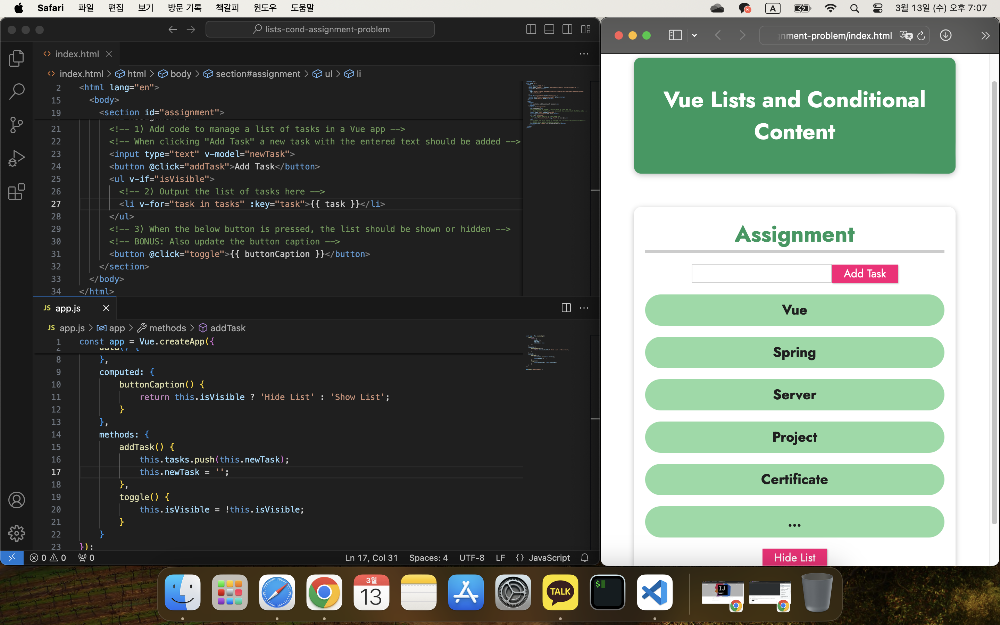

## 콘텐츠 조건부 렌더링 및 목록 렌더링

[Vue - 완벽 가이드 (Router 및 Composition API 포함)](https://www.udemy.com/course/vue-router-composition-api/?couponCode=ST12MT030524)

<br/>

**v-show 디렉티브**

이미 생성된 HTML 요소에 대해 display CSS 스타일 속성을 조작하여 화면에 보이지 않도록 할 수 있다.

*조건에 따라 요소를 숨기고 나타나게 할 뿐, 렌더링은 항상 수행된다.*

<br/>

**v-if, v-else, v-else-if 디렉티브**

v-if는 조건이 참인 경우에만 렌더링을 수행한다. v-if와 함께 v-else, v-else-if를 사용하면 자바스크립트의 if ~ else if ~ else 문과 같은 조건 처리를 할 수 있다.

<br/>

**v-for 디렉티브와 key 특성**

v-for은 반복적인 데이터를 렌더링하기 위해 사용하며, 자바스크립트의 for 문과 유사하다. 반복되는 각 요소를 Vue가 추적하고 재사용하기 위해 각 요소에는 고유한 식별자가 필요하다. 이를 위해 key 특성에 고유한 값을 바인딩해야 한다.

<br/>

### 실습: 콘텐츠 조건부 렌더링 및 목록



```html
<!DOCTYPE html>
<html lang="en">
  <head>
    <meta charset="UTF-8" />
    <meta name="viewport" content="width=device-width, initial-scale=1.0" />
    <title>Vue Basics</title>
    <link
      href="https://fonts.googleapis.com/css2?family=Jost:wght@400;700&display=swap"
      rel="stylesheet"
    />
    <link rel="stylesheet" href="styles.css" />
    <script src="https://unpkg.com/vue@3" defer></script>
    <script src="app.js" defer></script>
  </head>
  <body>
    <header>
      <h1>Vue Lists and Conditional Content</h1>
    </header>
    <section id="assignment">
      <h2>Assignment</h2>
      <!-- 1) Add code to manage a list of tasks in a Vue app -->
      <!-- When clicking "Add Task" a new task with the entered text should be added -->
      <input type="text" v-model="newTask">
      <button @click="addTask">Add Task</button>
      <ul v-if="isVisible">
        <!-- 2) Output the list of tasks here -->
        <li v-for="task in tasks" :key="task">{{ task }}</li>
      </ul>
      <!-- 3) When the below button is pressed, the list should be shown or hidden -->
      <!-- BONUS: Also update the button caption -->
      <button @click="toggle">{{ buttonCaption }}</button>
    </section>
  </body>
</html>
```

<br />

```javascript
const app = Vue.createApp({
    data() {
        return {
            tasks: [],
            newTask: '',
            isVisible: true
        };
    },
    computed: {
        buttonCaption() {
            return this.isVisible ? 'Hide List' : 'Show List';
        }
    },
    methods: {
        addTask() {
            this.tasks.push(this.newTask);
            this.newTask = '';
        },
        toggle() {
            this.isVisible = !this.isVisible;
        }
    }
});

app.mount('#assignment');
```

<br />

```css
* {
  box-sizing: border-box;
}

html {
  font-family: 'Jost', sans-serif;
}

body {
  margin: 0;
}

header {
  box-shadow: 0 2px 8px rgba(0, 0, 0, 0.26);
  margin: 3rem;
  border-radius: 10px;
  padding: 1rem;
  background-color: #1b995e;
  color: white;
  text-align: center;
}

#assignment {
  box-shadow: 0 2px 8px rgba(0, 0, 0, 0.26);
  margin: 3rem;
  border-radius: 10px;
  padding: 1rem;
  text-align: center;
}

#assignment h2 {
  font-size: 2rem;
  border-bottom: 4px solid #ccc;
  color: #1b995e;
  margin: 0 0 1rem 0;
}

#assignment ul {
  list-style: none;
  margin: 1rem 0;
  padding: 0;
}

#assignment li {
  margin: 1rem 0;
  font-size: 1.25rem;
  font-weight: bold;
  background-color: #8ddba4;
  padding: 0.5rem;
  color: #1f1f1f;
  border-radius: 25px;
}

#assignment input {
  font: inherit;
  border: 1px solid #ccc;
}

#assignment input:focus {
  outline: none;
  border-color: #1b995e;
  background-color: #d7fdeb;
}

#assignment button {
  font: inherit;
  cursor: pointer;
  border: 1px solid #ff0077;
  background-color: #ff0077;
  color: white;
  padding: 0.05rem 1rem;
  box-shadow: 1px 1px 2px rgba(0, 0, 0, 0.26);
}

#assignment button:hover,
#assignment button:active {
  background-color: #ec3169;
  border-color: #ec3169;
  box-shadow: 1px 1px 4px rgba(0, 0, 0, 0.26);
}
```