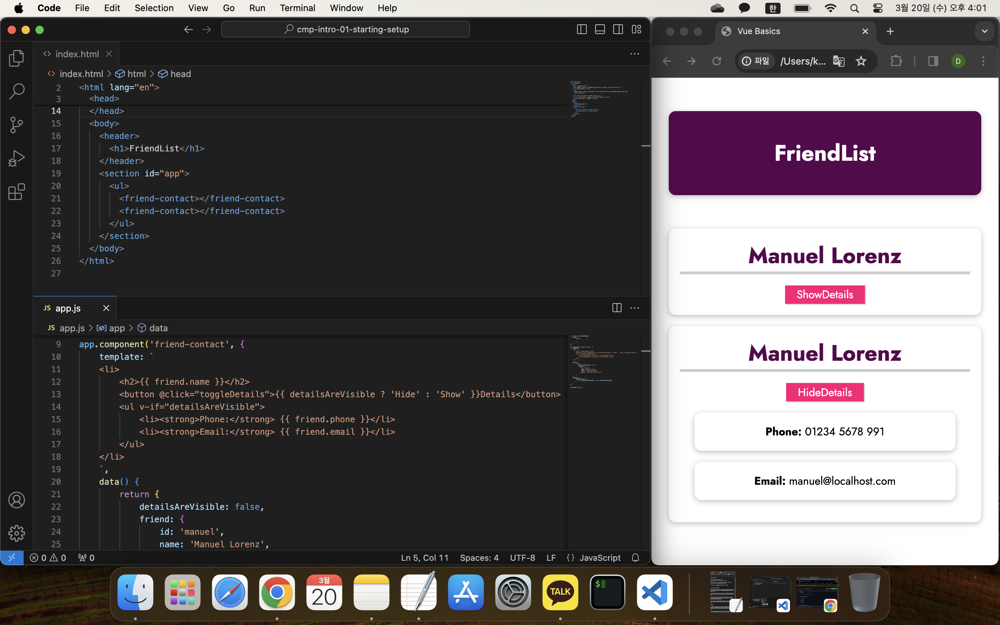

## 컴포넌트 소개

[Vue - 완벽 가이드 (Router 및 Composition API 포함)](https://www.udemy.com/course/vue-router-composition-api/?couponCode=ST12MT030524)

<br/>

**컴포넌트 소개**

`app.component()` 메서드는 두 개의 인수를 갖는다.<br/>
첫 번째 인수는 컴포넌트의 식별자이며, 두 번째 인수는 `createApp()` 메서드에 전달한 것과 동일한 구성 객체이다.

컴포넌트는 기본적으로 커스텀 HTML 요소로 취급된다. <br/>
커스텀 HTML 태그는 대시(-) 기호를 포함한 두 단어로 구성되어야 하며, 이는 공식 내장 HTML 요소와의 충돌을 방지하기 위함이다.

<br/>



```html
<!DOCTYPE html>
<html lang="en">
  <head>
    <meta charset="UTF-8" />
    <meta name="viewport" content="width=device-width, initial-scale=1.0" />
    <title>Vue Basics</title>
    <link
      href="https://fonts.googleapis.com/css2?family=Jost:wght@400;700&display=swap"
      rel="stylesheet"
    />
    <link rel="stylesheet" href="styles.css" />
    <script src="https://unpkg.com/vue@3" defer></script>
    <script src="app.js" defer></script>
  </head>
  <body>
    <header>
      <h1>FriendList</h1>
    </header>
    <section id="app">
      <ul>
        <friend-contact></friend-contact>
        <friend-contact></friend-contact> 
      </ul>
    </section>
  </body>
</html>
```

<br/>

```javascript
const app = Vue.createApp({
    data() {
        return {
            
        };
    }
});

app.component('friend-contact', {
    template: `
    <li>
        <h2>{{ friend.name }}</h2>
        <button @click="toggleDetails">{{ detailsAreVisible ? 'Hide' : 'Show' }}Details</button>
        <ul v-if="detailsAreVisible">
            <li><strong>Phone:</strong> {{ friend.phone }}</li>
            <li><strong>Email:</strong> {{ friend.email }}</li>
        </ul>
    </li>
    `,
    data() {
        return { 
            detailsAreVisible: false,
            friend: {
                id: 'manuel',
                name: 'Manuel Lorenz',
                phone: '01234 5678 991',
                email: 'manuel@localhost.com',
            }
        };
    },
    methods: {
        toggleDetails() {
            this.detailsAreVisible = !this.detailsAreVisible;
        }
    }
});

app.mount('#app');
```

<br/>

```css
* {
  box-sizing: border-box;
}

html {
  font-family: 'Jost', sans-serif;
}

body {
  margin: 0;
}

header {
  box-shadow: 0 2px 8px rgba(0, 0, 0, 0.26);
  margin: 3rem auto;
  border-radius: 10px;
  padding: 1rem;
  background-color: #58004d;
  color: white;
  text-align: center;
  width: 90%;
  max-width: 40rem;
}

#app ul {
  margin: 0;
  padding: 0;
  list-style: none;
}

#app li {
  box-shadow: 0 2px 8px rgba(0, 0, 0, 0.26);
  margin: 1rem auto;
  border-radius: 10px;
  padding: 1rem;
  text-align: center;
  width: 90%;
  max-width: 40rem;
}

#app h2 {
  font-size: 2rem;
  border-bottom: 4px solid #ccc;
  color: #58004d;
  margin: 0 0 1rem 0;
}

#app button {
  font: inherit;
  cursor: pointer;
  border: 1px solid #ff0077;
  background-color: #ff0077;
  color: white;
  padding: 0.05rem 1rem;
  box-shadow: 1px 1px 2px rgba(0, 0, 0, 0.26);
}

#app button:hover,
#app button:active {
  background-color: #ec3169;
  border-color: #ec3169;
  box-shadow: 1px 1px 4px rgba(0, 0, 0, 0.26);
}
```