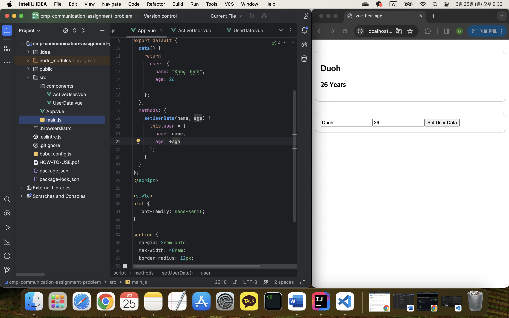

## 컴포넌트 통신

[Vue - 완벽 가이드 (Router 및 Composition API 포함)](https://www.udemy.com/course/vue-router-composition-api/?couponCode=ST12MT030524)

<br/>

**컴포넌트의 조합**

컴포넌트들은 부모-자식 관계로 트리 구조를 형성하고, 부모 컴포넌트가 자식 컴포넌트를 포함하는 형태가 된다. 여러 컴포넌트들을 조합하여 개발할 때, 컴포넌트 간의 정보 전달이 필요하다. 이를 위해 속성(props)과 이벤트(event)를 사용하여 데이터를 전달하고 상호작용한다.

<br/>

**속성**

[지원되는 프로퍼티 값](https://v3.vuejs.org/guide/component-props.html)

컴포넌트들은 속성(props)을 통해 자식 컴포넌트로 정보를 전달할 수 있으며, 전달 방향은 부모에서 자식으로만 향한다.
  
```javascript
export default {
  props: {
    속성명1 : 타입명,
    속성명2 : [타입명1, 타입명2],
    속성명3 : {
      type : 타입명,
      required : [true/false, 기본값:false],
      default : [기본값 또는 기본값을 리턴하는 함수, 기본값:undefined]
    },
    ...
  }
}
```

<br/>

**사용자 정의 이벤트**

자식 컴포넌트는 이벤트를 발신(emit)하여 부모 컴포넌트로 데이터를 전달할 수 있으며, 이를 위해 자식 컴포넌트에서 사용자 정의 이벤트를 정의하고 발생시킨다.

부모 컴포넌트에서는 이벤트 핸들러 메서드를 정의하여 해당 이벤트를 처리한다.

```javascript
// 자식 컴포넌트
this.$emit('event-name', eventArgs1, eventArgs2, ...)
```

```vue
// 부모 컴포넌트
<child-component @event-name="handlerMethod" />

methods : {
  handlerMethod(eventArgs1, eventArgs2, ...) {
    // 전달받은 아규먼트로 처리할 코드 작성
  }
}
```

<br/>
  
이벤트 유효성 검증
```javascript
const Component = {
  ...
  emits : ["이벤트명1", "이벤트명2"]
  ...
}
```

```javascript
// 전달하는 이벤트 아규먼트의 유효성 여부까지 확인할 수 있음
const Component = {
  ...
  emits : {
    이벤트명1 : (e) => {
      // true가 리턴되면 유효, false가 리턴되면 유효하지 않음
    },
      // 유효성 검사 하지 않음
    이벤트명2 : null,
      ...
  },
  ...
}
```

<br/>

**폴스루 프로퍼티**

[폴스루란?](https://vuejs.org/guide/components/attrs.html)

등록하지 않은 프로퍼티를 컴포넌트 내부에 설정하거나 등록하지 않은 이벤트를 컴포넌트 내부에서 수신할 수 있다.

<br/>

**provide + inject**

공용 데이터를 부모 컴포넌트에 제공(provide)하고 하위 컴포넌트 트리상의 어느 컴포넌트에서나 필요한 데이터를 주입(inject)하여 사용하도록 하는 방법이다. 이는 복잡한 컴포넌트 계층 구조에서 데이터를 효율적으로 전달하기 위해 사용되며, 반응성이 있는 데이터를 공유하는 경우에는 사용을 고려해 보아야 한다.

<br/>

### 실습: 프로퍼티 및 커스텀 이벤트



```javascript
// main.js

import { createApp } from 'vue';

import ActiveUser from "./components/ActiveUser.vue";
import UserData from "./components/UserData.vue";
import App from './App.vue';

const app = createApp(App);

app.component('active-user', ActiveUser);
app.component('user-data', UserData);

app.mount('#app');
```

<br/>

```vue
<!-- App.vue -->

<template>
  <div>
    <active-user :username="user.name" :userage="user.age"></active-user>
    <user-data @set-data="setUserData"></user-data>
  </div>
</template>

<script>
export default {
  data() {
    return {
      user: {
        name: "Kang Duoh",
        age: 26
      }
    };
  },
  methods: {
    setUserData(name, age) {
      this.user = {
        name: name,
        age: +age
      };
    }
  }
};
</script>

<style>
html {
  font-family: sans-serif;
}

section {
  margin: 2rem auto;
  max-width: 40rem;
  border-radius: 12px;
  border: 1px solid #ccc;
  padding: 1rem;
}
</style>
```

<br/>

```vue
<!-- ActiveUser.vue -->

<template>
  <section>
    <h2>{{ username }}</h2>
    <h3>{{ userage }} Years</h3>
  </section>
</template>

<script>
export default {
  props: {
    username: {
      type: String,
      required: true
    },
    userage: {
      type: Number,
      required: true
    }
  }
};
</script>
```

<br/>

```vue
<!-- UserData.vue -->

<template>
  <section>
    <form @submit.prevent="submitData">
      <input type="text" placeholder="Your name" v-model="enteredName"/>
      <input type="text" placeholder="Your age" v-model="enteredAge"/>
      <button>Set User Data</button>
    </form>
  </section>
</template>

<script>
export default {
  emits: ['set-data'],
  data() {
    return {
      enteredName: "",
      enteredAge: ""
    };
  },
  methods: {
    submitData() {
      this.$emit('set-data', this.enteredName, this.enteredAge);
    }
  }
};
</script>
```