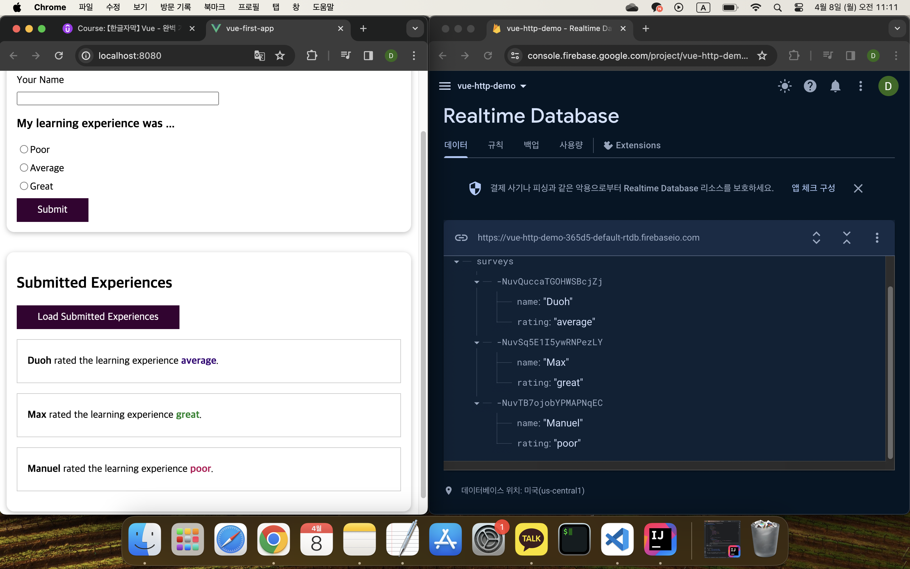

## HTTP 요청 보내기

[Vue - 완벽 가이드 (Router 및 Composition API 포함)](https://www.udemy.com/course/vue-router-composition-api/?couponCode=ST12MT030524)

<br/>

**Firebase**

Firebase는 백엔드를 제공하는 서비스로, 데이터를 저장하고 관리하기 위해 Realtime Database를 사용한다.



```javascript
fetch('https://vue-http-demo-365d5-default-rtdb.firebaseio.com/surveys.json')
```

*자신의 데이터베이스 URL/ 뒤에 원하는 식별자를 추가할 수 있으며, 마지막에 .json을 추가해야 한다. 이는 Firebase에 국한된 요구사항이다.*

<br/>

**fetch 메서드와 axios 라이브러리**

Vue 애플리케이션에서 서버와의 통신을 위해 HTTP 요청을 보내는 데에는 fetch 메서드와 axios 라이브러리가 널리 사용된다. *실습은 fetch 메서드를 사용하여 진행한다.*

- fetch 메서드
    
    브라우저에 내장된 API로, 별도의 패키지 설치가 필요하지 않다.

- axios

    HTTP 통신을 위한 자바스크립트 라이브러리로, npm 패키지를 설치해야 한다. 브라우저 호환성, timeout 기능, JSON 자동 변환 등 여러 장점이 있다.

<br/>

**HTTP 요청**

HTTP 요청은 클라이언트가 서버에게 특정한 동작을 요청하는 메시지이다. 각각의 요청은 서버에게 어떤 동작을 수행할지 알려주는데, 이를 HTTP 요청 메서드라고 한다. 주요한 HTTP 요청 메서드로는 GET, POST, DELETE 등이 있으며, 각각의 메서드는 서버에서 다른 동작을 수행한다.

- POST 요청
  
  서버에 새로운 데이터를 전송하여 리소스를 생성하거나 업데이트한다.

    ```javascript
    fetch('https://vue-http-demo-365d5-default-rtdb.firebaseio.com/surveys.json', {
        method: 'POST', // POST 메서드 사용
        headers: {
            'Content-Type': 'application/json'  // 헤더에 Content-Type을 JSON으로 설정
        },
        body: JSON.stringify({  // 데이터를 JSON 형식으로 변환하여 요청 본문에 추가
            name: this.enteredName,
            rating: this.chosenRating
        })
    })
        .then((response) => {   // 응답 처리
            if (response.ok) {  // 응답이 성공적인 경우
                // ...
            } else {    // 응답이 실패한 경우
                throw new Error('Could not save data!');    // 에러 throw
            }
        })
        .catch((error) => {  // 오류 처리
            console.log(error); // 에러 메시지 출력
            this.error = error.message; // 에러 메시지를 저장
        });
    ```

<br/>

- GET 요청
  
  서버로부터 리소스를 요청하며, 주로 데이터를 조회할 때 사용된다.

  *GET 요청은 기본 설정이며, 데이터를 받아오는 경우 본문을 필요로 하지 않는다.*

    ```javascript
    fetch('https://vue-http-demo-365d5-default-rtdb.firebaseio.com/surveys.json')
        .then((response) => {
            if (response.ok) {
                return response.json(); // JSON 형식으로 파싱된 데이터를 반환
            }
        })
        .then((data) => {
            this.isLoading = false;
            const results = [];
            // 응답 데이터를 순회하면서 결과 배열에 객체를 추가
            for (const id in data) {
                results.push({
                    id: id,
                    name: data[id].name,
                    rating: data[id].rating,
                });
            }
            this.results = results; // 결과 배열을 컴포넌트의 데이터에 저장
        })
        .catch((error) => {
            console.log(error);
            this.isLoading = false;
            this.error = 'Failed to fetch data - please try again later.';
        });
    ```

<br/>

**HTTP 응답 상태 코드**

[HTTP 응답 상태 코드](https://developer.mozilla.org/en-US/docs/Web/HTTP/Status)는 특정 HTTP 요청이 성공적으로 완료되었는지 여부를 나타낸다. 응답은 다음의 5가지 클래스로 분류된다.

- 1xx (정보 응답)
- 2xx (성공적인 응답)
- 3xx (리다이렉션 메시지)
- 4xx (클라이언트 오류 응답)
- 5xx (서버 오류 응답)