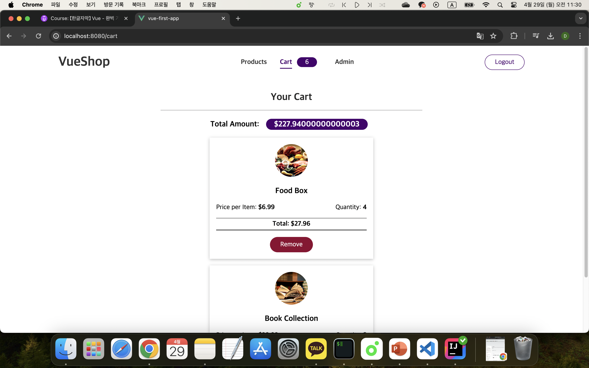

## Vuex

[Vue - 완벽 가이드 (Router 및 Composition API 포함)](https://www.udemy.com/course/vue-router-composition-api/?couponCode=ST12MT030524)

<br/>

Vuex는 Vue.js 애플리케이션의 전역 상태를 관리하기 위한 라이브러리이다.

여러 컴포넌트에서 공유되는 데이터를 중앙 집중식으로 관리함으로써 상태 관리의 복잡성을 줄일 수 있다.

<br/>

**Vuex 설치 및 기본 사용법**

```bash
npm install --save vuex@next
```

*@next는 최신 버전 설치를 의미*

```javascript
import { createApp } from 'vue';
import { createStore } from 'vuex';

import App from './App.vue';

const store = createStore({ // 저장소 생성
    state() { // 상태(state) 정의
      ...
    },
    mutations: { // 변형(mutations) 정의
      ...
    },
    actions: { // 액션(actions) 정의   
      ...
    },
    getters: { // 게터(getters) 정의
      ...
    }
});

const app = createApp(App);
app.use(store); // Vue 애플리케이션에 Vuex 저장소 연결
app.mount('#app');
```

<br/>

**상태 관리**

Vuex를 사용하여 애플리케이션의 상태를 중앙에서 관리한다. 모든 컴포넌트에서 `$store` 객체를 통해 상태에 접근할 수 있다.

```javascript
// App.vue
...
export default {
  ...
  methods: {
    addOne() {
      this.$store.state.counter++; // 직접적인 상태 변경
    }
  }
}
...
```

*직접적인 상태 변경보다는 mutations을 통한 상태 변경이 권장된다.*

<br/>

**변형(Mutation)**

상태를 동기적으로 변경하는 방법으로, 직접적인 상태 변경 대신 `commit` 메서드를 통해 변형을 호출한다.

```javascript
// App.vue
...
export default {
  ...
  methods: {
    addOne() {
      // this.$store.commit('increase', { value: 10 });
      this.$store.commit({
        type: 'increase',
        value: 10
      });
    }
  }
}
...
```

```javascript
// main.js
const store = createStore({
  ...
  mutations: {
    increment(state) {
      state.counter = state.counter + 2;
    },
    increase(state, payload) {
      state.counter = state.counter + payload.value;
    }
  }
});
```

<br/>

**액션(Actions)**

비동기 작업을 처리하는 데 사용되며, 컴포넌트는 `dispatch` 메서드를 통해 액션을 호출할 수 있다.

```javascript
// App.vue
...
methods: {
  addOne() {
    // this.$store.dispatch('increase', { value: 10 });
    this.$store.dispatch({
      type: 'increase',
      value: 10
    });
  },
},
```

```javascript
// ChangeCounter.vue
...
export default {
  methods: {
    addOne() {
      this.$store.dispatch('increment');
    }
  }
}
```

<br/>

**게터(Getters)**

저장소의 상태를 계산하는 데 사용되며, 컴포넌트에서는 `$store.getters` 를 통해 게터에 접근할 수 있다.

```javascript
// main.js
...
const store = createStore({
    ...
    getters: {
      finalCounter(state) {
        return state.counter * 3;
      },
      normalizedCounter(_, getters) { // 밑줄(_)로 대체한 것은 JavaScript의 관행으로, 이 인수로 작업하지 않는다는 뜻.
        const finalCounter = getters.finalCounter;
        if (finalCounter < 0) {
          return 0;
        }
        if (finalCounter > 100) {
          return 100;
        }
        return finalCounter;
      }
    }
});
```

```javascript
// FavoriteValue.vue
...
export default {
  computed: {
    counter() {
      return this.$store.getters.normalizedCounter;
    },
  }
};
```

```javascript
// TheCounter.vue
...
export default {
  computed: {
    counter() {
      return this.$store.getters.finalCounter;
    },
  }
};
```

<br/>

**매퍼 헬퍼(Mapper Helper)**

매퍼 헬퍼는 Vuex에서 컴포넌트의 코드를 간결하게 유지하면서도 Vuex 스토어의 기능을 쉽게 사용할 수 있게 해주는 유틸리티 함수이다.

- `mapGetters`: Vuex의 게터를 컴포넌트의 연산 프로퍼티로 매핑한다. 이를 통해 게터를 컴포넌트에서 직접 호출할 필요 없이 간단하게 사용할 수 있다.

    ```javascript
    // TheCounter.vue
    ...
    import { mapGetters } from 'vuex';

    export default {
        computed: {
            // (...) 스프레드를 사용하면 연산 프로퍼티 내부로 객체를 퍼뜨릴 수 있다.
            ...mapGetters(['finalCounter'])
        },
    };
    ```

- `mapActions`: Vuex의 액션을 컴포넌트의 메서드로 매핑한다. 이를 통해 액션을 컴포넌트 내에서 호출할 수 있도록 한다.

    ```javascript
    // ChangeCounter.vue
    ...
    import { mapActions } from 'vuex';

    export default {
        methods: {
            // ...mapActions(['increment', 'increase'])
            ...mapActions({ // 배열 대신 객체를 전달하여, 컴포넌트 내에서 사용할 메서드 이름을 변경할 수 있다.
                inc: 'increment',
                increase: 'increase'
            })
        }
    }
    ```

<br/>

**모듈화**

모듈화는 큰 규모의 애플리케이션에서 상태 관리를 보다 체계적으로 관리하기 위한 방법이다.

- Modules: Vuex의 기능을 사용하여 상태, 변형, 액션, 게터를 각각의 모듈로 분리하여 관리할 수 있다. 이를 통해 각 기능이나 역할에 따라 코드를 논리적으로 구조화할 수 있다.

- Namespaced: 모듈이 커지고 복잡해질 경우, 네임스페이스를 사용하여 모듈을 더 명확하게 구분할 수 있다. 네임스페이스를 활성화하면 모듈의 actions, mutations, getters는 모듈의 경로를 기반으로 접근해야 한다.

    ```javascript
    // main.js
    ...
    const counterModule = {
        namespaced: true, // 네임스페이스 활성화, 모듈 전체가 저장소로부터 분리되어야 한다는 걸 Vuex에 알림.
        state() {
        ...
        },
        mutations: {
        ...
        },
        actions: {
        ...
        },
        getters: {
        ...
        }
    };

    const store = createStore({
        modules: {
            numbers: counterModule  // 모듈 등록
        },
        state() {
            ...
        },
        mutations: {
            ...
        },
        actions: {
            ...
        },
        getters: {
            ...
        }
    });
    ...
    ```

<br/>

**구조화 및 파일 관리**

- Vuex 코드 및 파일을 구조화하여 유지보수를 용이하게 할 수 있다.
- 모듈화된 Vuex 코드를 사용하여 각 모듈별로 파일을 관리할 수 있다.

<br/>



[데모 온라인 상점_ 소스코드](https://github.com/kduoh99/TIL/tree/main/Vue.js/Vue__The_Complete_Guide/PJ/vuex-11-a-challenge-starting-code/src)