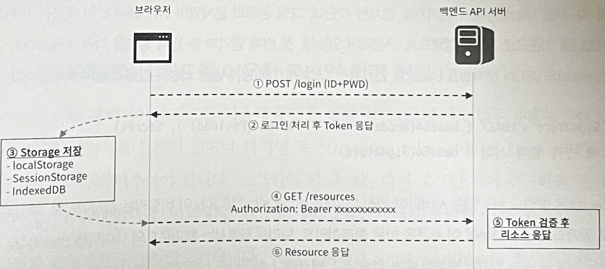
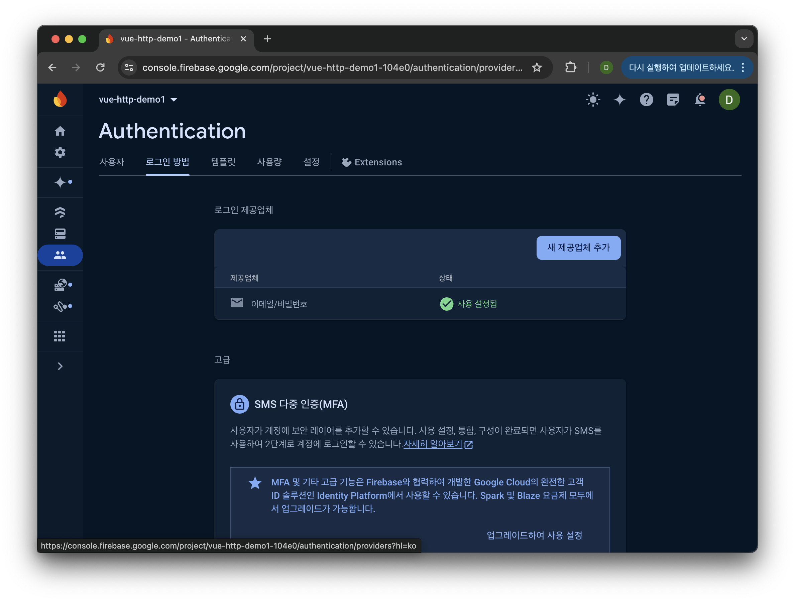
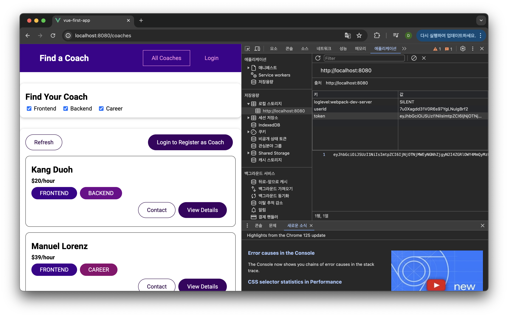

## Vue 및 인증

[Vue - 완벽 가이드 (Router 및 Composition API 포함)](https://www.udemy.com/course/vue-router-composition-api/?couponCode=ST12MT030524)

<br/>

**라우팅과 인증 처리**

- 토큰 기반 인증
  
  Vue 애플리케이션에서 인증 처리를 수행하려면 백엔드 API 서버를 개발하거나 Firebase와 같은 서버리스 서비스를 이용해야 한다. 프론트엔드는 사용자가 입력한 ID와 PWD를 백엔드 인증 API 서버로 전달하여 인증을 요청하고, 백엔드 서버는 유효한 자격 증명일 경우 토큰을 생성하여 응답한다.

  프론트엔드는 응답받은 토큰을 브라우저의 저장소(IndexedDB, localStorage, sessionStorage 등)에 저장한다. 이후 인증된 사용자만 접근할 수 있는 리소스를 요청할 때, 저장된 토큰을 Authorization 헤더나 쿠키에 포함시켜 전송하며, 백엔드는 토큰을 검증하고 유효하면 요청된 리소스를 응답한다.

  <br/>

  *아래 이미지는 차례로 '백엔드 API를 이용한 인증 처리 과정', 'Authentication', 'Local Storage'를 나타낸다.*

  

  
  
  
  
  <br/>

- 내비게이션 가드를 이용한 로그인 화면 전환
  
  내비게이션 가드를 사용하여 브라우저에 저장된 토큰을 확인한다. 토큰이 없거나 만료된 경우, 로그인 화면으로 자동 전환된다. 사용자가 로그인에 성공하면, 로그인 전에 접근하려 했던 경로로 이동시킨다. 이를 통해 사용자는 인증된 상태에서만 특정 리소스에 접근할 수 있고, 로그인 후 하고자 한 작업을 이어서 할 수 있다.

  ```javascript
  router.beforeEach(function(to, _, next) {
    if (to.meta.requiresAuth && !store.getters.isAuthenticated) {
        next('/auth');
    } else if (to.meta.requiresUnauth && store.getters.isAuthenticated) {
        next('/coaches');
    } else {
        next();
    }
  });
  ```

  *자세한 소스코드는 아래의 링크를 참조*

<br/>

**애플리케이션에 인증 절차 추가**

회원가입과 로그인 기능을 포함한 인증 절차를 애플리케이션에 추가한다.<br/>
Vuex를 사용하여 HTTP 요청과 로그인 상태를 관리하고, 자동 로그인 및 자동 로그아웃 기능도 구현한다.

*해당 프로젝트는 Firebase를 사용하였지만, 다른 백엔드와도 동일한 원리로 연결할 수 있다.*

<br/>

["코치 찾기" 웹 앱_ 소스코드](https://github.com/kduoh99/TIL/tree/main/Vue.js/Vue__The_Complete_Guide/PJ/main-prj-01-starting-setup/src)