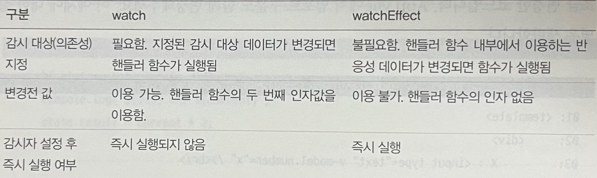
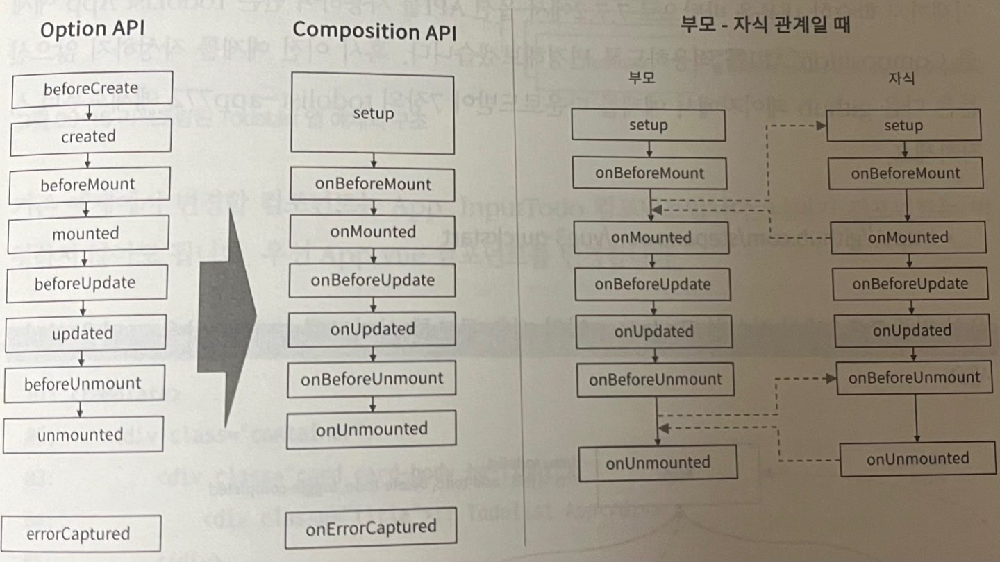
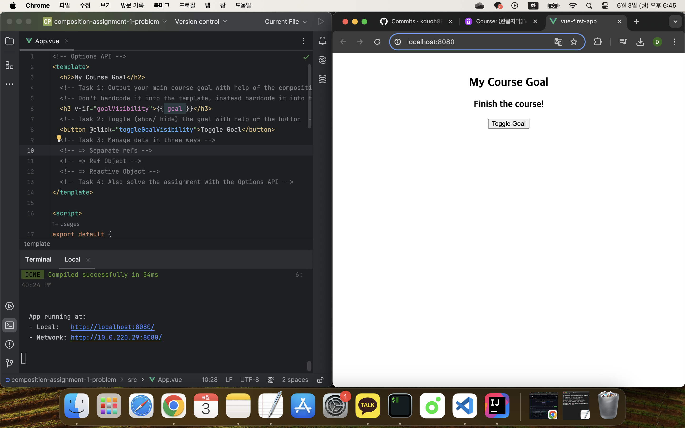
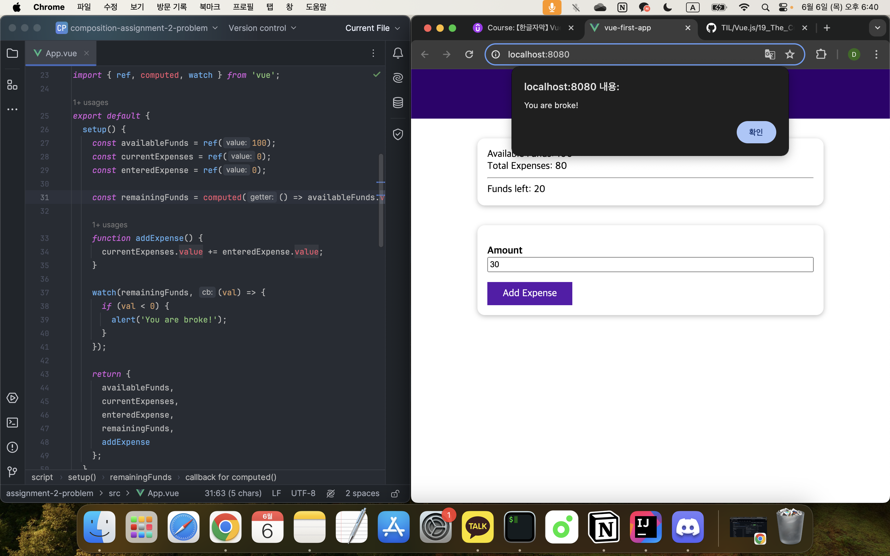

## 컴포지션 API - 옵션 API 대체하기

[Vue - 완벽 가이드 (Router 및 Composition API 포함)](https://www.udemy.com/course/vue-router-composition-api/?couponCode=ST12MT030524)

<br/>

**Composition API란?**

Composition API는 Vue 3에서 새롭게 도입된 함수 기반 API로, 컴포넌트 로직을 모듈화하고 재사용성을 높이기 위해 설계되었다. 기존의 Options API는 여러 옵션(data, methods, computed, watch 등)을 통해 컴포넌트를 작성하는 반면, Composition API는 `setup()` 메서드를 중심으로 로직을 구성한다. 이는 대규모 애플리케이션에서 컴포넌트 로직의 분산 문제를 해결하고, 코드의 가독성과 유지보수성을 높여준다.

<br/>

**setup 메서드를 이용한 초기화**

초기화 작업을 수행하는 `setup()` 메서드를 이용하여 컴포넌트의 상태를 초기화한다.

*기존 Options API의 생명주기와 비교하자면 `beforeCreate`, `created` 단계에서 `setup()` 메서드가 호출된다.*

`setup()` 메서드 내부에서 반응성을 가진 상태 데이터, 계산된 속성, 메서드, 생명주기 훅을 작성할 수 있고, 작성된 데이터와 메서드는 객체 형태로 반환하여 템플릿에서 사용할 수 있다.
또한, 부모 컴포넌트로부터 전달받는 속성(props)와 컴포넌트 컨텍스트(component context)를 인자로 가질 수 있다.

<br/>

**반응성을 가진 상태 데이터**

- ref
  
  단일 값의 반응성을 관리하기 위해 사용한다.<br/>
  `ref()` 함수의 인자로 초기값을 설정하며, 반환된 ref 객체의 `.value` 속성을 통해 값에 접근하거나 변경할 수 있다.

  ```javascript
  const count = ref(0);
  console.log(count.value); // 0
  count.value++;
  console.log(count.value); // 1
  ```

- reactive
  
  객체의 반응성을 관리하기 위해 사용한다.<br/>
  `reactive()` 함수는 객체를 인자로 받아 반응성 객체를 생성하며, 객체의 속성을 직접 접근하고 변경할 수 있다.

  ```javascript
  const state = reactive({ count: 0 });
  console.log(state.count); // 0
  state.count++;
  console.log(state.count); // 1
  ```

<br/>

**computed**

Composition API에서 계산된 속성은 `computed()` 함수를 사용하여 정의한다.<br/>
`computed()` 함수는 계산된 속성을 반환하며, 템플릿에서는 직접 이용할 수 있지만, 스크립트 내부에서는 `.value` 속성을 통해 접근해야 한다.

```javascript
const count = ref(0);
const newCount = computed(() => count.value * 2);
console.log(newCount.value); // 0
count.value++;
console.log(newCount.value); // 2
```

<br/>

**watch와 watchEffect**

- watch
  
  데이터나 계산된 속성의 변화를 감시하고, 변화 시 특정 함수를 실행한다.<br/>
  `watch()` 함수는 첫 번째 인자로 감시할 반응성 데이터를, 두 번째 인자로 변경 시 실행할 핸들러 함수를 받는다.
  
  ```javascript
  watch( data, (current, old) => {
    // 처리하려는 연산 로직
  });
  ```

- watchEffect
  
  `watchEffect`는 Vue 3에서 반응성 데이터 의존성을 추적하는 기능을 제공하는 새로운 방법이다.<br/>
  기존 `watch`와의 차이점은 다음과 같다.

  

  ```javascript
  watchEffect( () => {
    // 반응성 데이터를 사용하는 코드 작성
  });
  ```

<br/>

**생명주기 훅(Life Cycle Hook)**



Composition API에서 생명주기 훅은 `on` 접두어를 붙인 함수로 사용된다.

```javascript
setup() {
  onMounted(() => {
    ...
  });
  ...
}
```

<br/>

**`<script setup>` 사용하기**

`<script setup>`은 Composition API를 단일 파일 컴포넌트에서 더 간편하게 사용할 수 있는 문법이다.<br/>

주요 장점은 다음과 같다.

- 적은 상용구 코드 사용으로 간결한 코드를 작성할 수 있다.
- 순수 타입스크립트 언어를 사용해 props, 이벤트를 선언할 수 있다.
- 런타임 성능이 더 좋다.
- IDE에서의 타입 추론 성능이 더 뛰어나다.

<br/>

주요 특징은 다음과 같다.
  
- 템플릿에서 사용하는 값
    
  `setup()` 함수 내에서 반환하지 않아도, 최상위의 변수와 함수를 템플릿에서 직접 사용할 수 있다.

- 컴포넌트 등록

  import한 컴포넌트를 components 옵션 없이 템플릿에서 지역 컴포넌트로 사용할 수 있다.

- 속성과 발신 이벤트 처리
  
  `defineProps`와 `defineEmits` 함수를 사용하여 속성과 `emit` 함수를 정의하고 사용할 수 있다.

  ```javascript
  // <script setup> 방식
  const props = defineProps({
    todoItem = { type : Object, required : true }
  });
  const emit = defineEmits(['delete-todo', 'toggle-completed']);
  // 이벤트 발신
  emit('delete-todo', id);
  ```

<br/>

### 실습: 데이터 및 함수



```vue
<!-- Composition API -->
<template>
  <h2>My Course Goal</h2>
  <h3 v-if="courseData.goalVisibility">{{ courseData.goal }}</h3>
  <button @click="toggleGoalVisibility">Toggle Goal</button>
</template>

<script>
import { reactive } from 'vue';

export default {
  setup() {
  // Reactive Object
    const courseData = reactive({
      goal: 'Finish the course!',
      goalVisibility: false
    });
  
    function toggleGoalVisibility() {
      courseData.goalVisibility = !courseData.goalVisibility;
    }
  
    return {
      courseData,
      toggleGoalVisibility
    };
  }
};
</script>

<style>
html {
  font-family: sans-serif;
}

body {
  margin: 3rem;
  text-align: center;
}
</style>
```

```vue
<!-- Options API -->
<template>
  <h2>My Course Goal</h2>
  <h3 v-if="goalVisibility">{{ goal }}</h3>
  <button @click="toggleGoalVisibility">Toggle Goal</button>
</template>

<script>
export default {
  data() {
    return {
      goal: 'Finish the course!',
      goalVisibility: false
    };
  },
  methods: {
    toggleGoalVisibility() {
      this.goalVisibility = !this.goalVisibility;
    }
  },
};
</script>

<style>
html {
  font-family: sans-serif;
}

body {
  margin: 3rem;
  text-align: center;
}
</style>
```

<br/>

### 실습: 컴포지션 API 핵심 구성



```
<template>
  <header>
    <h1>Expense Tracker</h1>
  </header>
  <section>
    <div>Available Funds: {{ availableFunds }}</div>
    <div>Total Expenses: {{ currentExpenses }}</div>
    <hr />
    <div>Funds left: {{ remainingFunds }}</div>
  </section>
  <section>
    <form @submit.prevent="addExpense">
      <div>
        <label for="amount">Amount</label>
        <input id="amount" type="number" v-model="enteredExpense" />
      </div>
      <button>Add Expense</button>
    </form>
  </section>
</template>

<script>
import { ref, computed, watch } from 'vue';

export default {
  setup() {
    const availableFunds = ref(100);
    const currentExpenses = ref(0);
    const enteredExpense = ref(0);

    const remainingFunds = computed(() => availableFunds.value - currentExpenses.value);

    function addExpense() {
      currentExpenses.value += enteredExpense.value;
    }

    watch(remainingFunds, (val) => {
      if (val < 0) {
        alert('You are broke!');
      }
    });

    return {
      availableFunds,
      currentExpenses,
      enteredExpense,
      remainingFunds,
      addExpense
    };
  }
};
</script>

<style>
* {
  box-sizing: border-box;
}

html {
  font-family: sans-serif;
}

body {
  margin: 0;
}

header {
  width: 100%;
  height: 5rem;
  display: flex;
  justify-content: center;
  align-items: center;
  background-color: #30006e;
  color: white;
}

section {
  margin: 2rem auto;
  max-width: 35rem;
  padding: 1rem;
  box-shadow: 0 2px 8px rgba(0, 0, 0, 0.26);
  border-radius: 12px;
}

form div {
  margin: 1rem 0;
}

input {
  width: 100%;
  padding: 0.15rem;
}

label {
  font-weight: bold;
  margin: 0.5rem 0;
}

button {
  background-color: #30006e;
  border: 1px solid #30006e;
  font: inherit;
  cursor: pointer;
  padding: 0.5rem 1.5rem;
  color: white;
}

button:hover,
button:active {
  background-color: #5819ac;
  border-color: #5819ac;
}
</style>
```

<br/>

[옵션 API에서 컴포지션 API로 이전하기_ 소스코드](https://github.com/kduoh99/TIL/tree/main/Vue.js/Vue__The_Complete_Guide/PJ/composition-13-demo-starting-project/src)