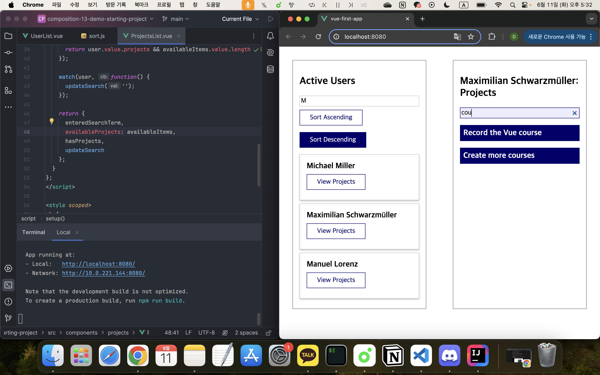

## 기능 재사용: 믹스인(Mixin) 및 커스텀 컴포지션 함수

[Vue - 완벽 가이드 (Router 및 Composition API 포함)](https://www.udemy.com/course/vue-router-composition-api/?couponCode=ST12MT030524)

 

**재사용성이란?**

프로젝트 규모가 커질수록 컴포넌트 간 코드 중복이 발생할 수 있다. 코드 재사용은 프로젝트의 확장성과 유지보수성을 높이는 핵심 요소 중 하나이다. 이를 위해 Vue.js는 두 가지 주요 전략으로 Options API의 믹스인과 Composition API의 커스텀 컴포지션 함수를 제공한다.

 

**믹스인(Mixin)**

믹스인은 컴포넌트를 간결하게 만들고, 재사용 가능한 로직을 공유할 수 있게 해준다. 기본적으로 믹스인과 컴포넌트의 데이터는 병합되며, 충돌 시 컴포넌트 옵션이 우선된다. 결론적으로, 코드 중복을 줄이고 공통 기능을 여러 컴포넌트에서 재사용할 수 있게 한다.

- 전역 믹스인
  
  전역 믹스인은 애플리케이션의 모든 컴포넌트에 영향을 준다. 따라서 용도가 제한적이며, 일반적으로 로깅이나 분석 기능과 같이 모든 컴포넌트에 추가해야 하는 경우에 사용된다.

  *모든 컴포넌트에 영향을 미친다는 점에서 사용에 주의가 필요하다.*

- 믹스인의 단점
  
  믹스인을 적용한 컴포넌트에서는 선언하지 않은(믹스인이 제공하는) 속성이나 메서드를 이용할 수 있다. 이는 개발자가 컴포넌트에서 선언되지 않고 사용된 속성, 메서드를 확인하기 위해 믹스인 코드를 직접 열어보아야 한다는 의미이다. 또한, 여러 믹스인이 동일한 속성명이나 메서드명을 사용할 경우, 충돌 문제가 발생할 수 있다.

- [믹스인 참조 문서](https://vuejs.org/api/options-composition.html#mixins)

 

**커스텀 컴포지션 함수**

자바스크립트에서는 일반적으로 함수를 통해 기능을 공유하고 아웃소싱한다. 컴포지션 API에서는 이와 같은 방식으로 커스텀 컴포지션 함수를 사용하여 로직을 재사용할 수 있다. 이러한 함수를 훅(hook)이라고도 하며, 함수 이름은 관례적으로 `use` 로 시작한다.

- 커스텀 컴포지션 함수의 장점
  
  첫째, 매개변수를 추가하기 쉬워 다양한 용도로 사용할 수 있다. 이는 더 많은 재사용성과 유연성을 제공한다.

  둘째, 명확한 구조를 가지고 있어 코드의 가독성을 높인다. 커스텀 훅을 사용하면 독립적인 함수로 로직을 정의하므로, 각 컴포넌트에서 어떤 로직을 사용하는지 명확하게 볼 수 있어 유지보수성이 크게 향상된다.

  셋째, 다양한 컴포넌트에서 사용할 수 있어 유용하다. 각기 다른 컴포넌트에서도 동일한 훅을 재사용할 수 있어 코드의 중복을 줄이고 일관성을 유지할 수 있다.

 

[재사용성을 위해 커스텀 훅 사용_ 소스코드](https://github.com/kduoh99/TIL/tree/main/Vue.js/Vue__The_Complete_Guide/PJ/composition-13-demo-starting-project/src)